# OntiCards 用户手册

> 企业级智能数据中枢 · 让数据库"听得懂人话"

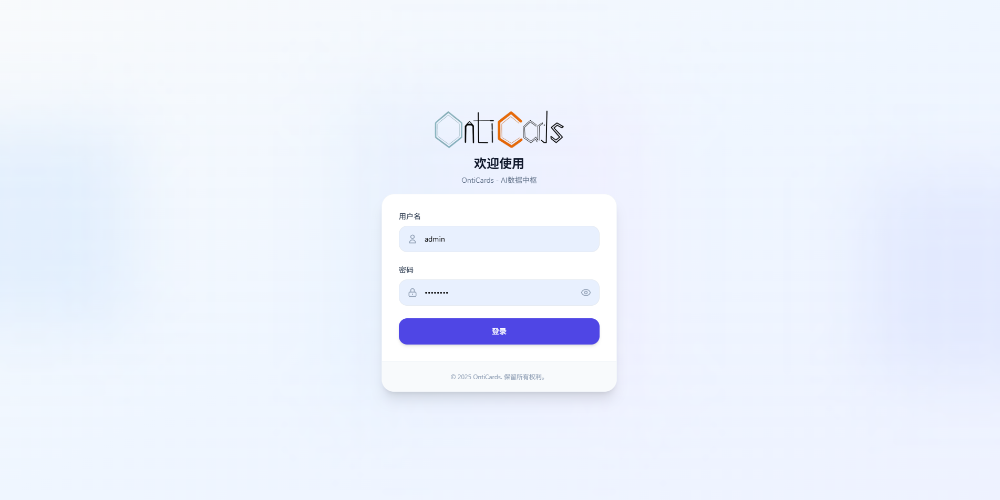

本手册详细介绍 **OntiCards** 各功能模块的使用方法，覆盖从登录初始化、数据源接入、智能问数、数据质检到系统管理的全流程操作，帮助业务人员、数据分析师、数据治理专员和管理者快速上手并用好这套 AI 数据中枢。


---

## 📖 目录

- [一、产品概述](#一产品概述)
  - [1.1 产品定位](#11-产品定位)
  - [1.2 核心能力](#12-核心能力)
  - [1.3 适用人群](#13-适用人群)
  - [1.4 主导航结构](#14-主导航结构)
- [二、登录与初始化](#二登录与初始化)
  - [2.1 登录方式](#21-登录方式)
  - [2.2 概览首页](#22-概览首页)
  - [2.3 首次使用流程](#23-首次使用流程)
- [三、工作空间（数据源管理）](#三工作空间数据源管理)
  - [3.1 工作空间总览](#31-工作空间总览)
  - [3.2 添加数据源](#32-添加数据源)
  - [3.3 支持的数据库类型](#33-支持的数据库类型)
  - [3.4 刷新数据源](#34-刷新数据源)
  - [3.5 删除数据源](#35-删除数据源)
- [四、数据源详情](#四数据源详情)
  - [4.1 概览](#41-概览)
  - [4.2 库表](#42-库表)
  - [4.3 卡片（数据卡片）](#43-卡片数据卡片)
  - [4.4 增强（字段注释增强）](#44-增强字段注释增强)
  - [4.5 问数（智能问数）](#45-问数智能问数)
  - [4.6 知识（业务术语库）](#46-知识业务术语库)
  - [4.7 历史（历史查询）](#47-历史历史查询)
  - [4.8 任务（数据盘点）](#48-任务数据盘点)
- [五、智能问数（自然语言查询）](#五智能问数自然语言查询)
  - [5.1 基本查询](#51-基本查询)
  - [5.2 多步推理查询](#52-多步推理查询)
  - [5.3 跨源融合查询](#53-跨源融合查询)
  - [5.4 查询结果解读](#54-查询结果解读)
  - [5.5 优化查询结果](#55-优化查询结果)
- [六、业务术语库](#六业务术语库)
  - [6.1 什么是业务术语库](#61-什么是业务术语库)
  - [6.2 创建术语库](#62-创建术语库)
  - [6.3 在数据源中关联术语库](#63-在数据源中关联术语库)
- [七、数据盘点](#七数据盘点)
  - [7.1 全域盘点](#71-全域盘点)
  - [7.2 定向盘点](#72-定向盘点)
  - [7.3 盘点结果管理](#73-盘点结果管理)
- [八、字段注释增强](#八字段注释增强)
  - [8.1 准备 Excel 字典文件](#81-准备-excel-字典文件)
  - [8.2 上传与配置](#82-上传与配置)
  - [8.3 查看增强结果](#83-查看增强结果)
- [九、数据质检](#九数据质检)
  - [9.1 规则库管理](#91-规则库管理)
  - [9.2 创建质检规则](#92-创建质检规则)
  - [9.3 执行质检](#93-执行质检)
  - [9.4 质量评分](#94-质量评分)
  - [9.5 质检报告](#95-质检报告)
- [十、监控中心](#十监控中心)
  - [10.1 监控总览](#101-监控总览)
  - [10.2 趋势分析](#102-趋势分析)
  - [10.3 实时监控](#103-实时监控)
  - [10.4 性能分析](#104-性能分析)
- [十一、成本管理](#十一成本管理)
  - [11.1 Token 价格配置](#111-token-价格配置)
  - [11.2 成本统计](#112-成本统计)
- [十二、系统与账户](#十二系统与账户)
  - [12.1 账户信息](#121-账户信息)
  - [12.2 用户管理](#122-用户管理)
  - [12.3 API 密钥](#123-api-密钥)
  - [12.4 模型配置](#124-模型配置)
  - [12.5 数据保密](#125-数据保密)
  - [12.6 鉴权日志](#126-鉴权日志)
  - [12.7 系统设置](#127-系统设置)
- [十三、数据安全](#十三数据安全)
- [十四、API 与第三方集成](#十四api-与第三方集成)
- [十五、SSO 单点登录对接（JWT 模式）](#十五sso-单点登录对接jwt-模式)
  - [15.1 什么是 JWT Token](#151-什么是-jwt-token)
  - [15.2 整体流程](#152-整体流程)
  - [15.3 配置清单](#153-配置清单)
  - [15.4 Token 生成详解](#154-token-生成详解)
  - [15.5 各语言示例](#155-各语言示例)
  - [15.6 拼接登录 URL 并跳转](#156-拼接登录-url-并跳转)
  - [15.7 回调接收 Token](#157-回调接收-token)
  - [15.8 错误码说明](#158-错误码说明)
  - [15.9 测试验证](#159-测试验证)
- [十六、常见问题（FAQ）](#十六常见问题faq)
- [十七、获取帮助](#十七获取帮助)

---

## 一、产品概述

### 1.1 产品定位

**OntiCards** 是面向企业的 **AI 数据中枢**（AI Data Hub），围绕业务数据库提供一站式能力：

> 📌 让企业数据库从「只有会写 SQL 才能使用」变成 **懂业务语言就可以查询、质检、管理、审计数据**。

与传统 BI 工具不同，OntiCards 以 **AI 驱动的自然语言交互** 为核心，让业务团队真正"自助"用数据；又与传统 NL2SQL 玩具不同，OntiCards 把 **数据接入 → 元数据理解 → 智能问数 → 数据质检 → 平台管理** 串成一条完整的闭环。

### 1.2 核心能力

| 能力             | 说明                                                                     |
| -------------- | ---------------------------------------------------------------------- |
| 📡 **多源数据接入**  | 支持 MySQL、PostgreSQL、Oracle、达梦、人大金仓、OceanBase、SQL Server、Trino、SQLite 等 |
| 🧠 **智能数据理解**  | 自动生成数据卡片、字段画像、业务术语库、AI 表关系盘点                                           |
| 🔍 **自然语言查询**  | NL2SQL 引擎，多步推理，多数据库方言适配，业务术语自动展开，安全校验                                  |
| 🔗 **跨源融合查询**  | 一次提问同时查询多个数据源，自动对齐结果，打破数据孤岛                                            |
| ✅ **数据质检平台**   | 多种质检规则、质量评分、自动化质检报告                                                    |
| 🏢 **企业级平台能力** | 数据源隔离、敏感脱敏、操作审计、API-Key、JWT-SSO、查询监控与成本统计                              |
| 🤖 **第三方集成**   | 通过 API-Key 对接智能体、RPA、BI 平台、自研系统                                        |

### 1.3 适用人群

| 角色        | 使用场景            | 获得价值              |
| --------- | --------------- | ----------------- |
| 业务运营人员    | 日常数据监控、异常排查     | 自助查询，无需等待数据团队     |
| 数据分析师     | 验证假设、临时查询、跨库整合  | 节省写 SQL 时间，专注分析工作 |
| 数据治理专员    | 规则库配置、质检执行、术语统一 | 系统化提升数据质量         |
| 管理层       | 多数据源汇总对比、决策支持   | 获得全局视图，快速决策       |
| IT / 数据团队 | 数据源管理、权限管控、审计监控 | 统一管控平台，降低运维成本     |
| 业务系统开发者   | 通过 API 集成智能问数能力 | 为业务系统注入 AI 问数能力   |

### 1.4 主导航结构

登录后左侧主导航包含以下模块：

| 导航    | 路径                | 用途                    |
| ----- | ----------------- | --------------------- |
| 概览    | `/overview`       | 数据源全景、使用流程、快捷入口       |
| 工作空间  | `/workspaces`     | 管理所有数据源、进入数据源详情       |
| 业务术语  | `/business-terms` | 跨数据源共享的业务术语库          |
| 数据质检  | `/governance`     | 规则库、执行、报告             |
| 监控中心  | `/monitoring`     | 实时查询量、Token、性能监控      |
| 成本管理  | `/cost-config`    | Token 成本与每日成本趋势       |
| 系统与账户 | `/settings`       | 账户、用户、API-Key、模型、保密设置 |
| 帮助    | `/help`           | 文档、FAQ、问题反馈           |

---

## 二、登录与初始化

### 2.1 登录方式

访问 OntiCards 后将进入登录页面。系统提供以下登录方式：

**方式一：用户名密码登录（默认）**


- 在用户名输入框填写账户名
- 在密码输入框填写密码（点击眼睛图标可显示明文）
- 点击「登录」按钮

> 💡 忘记密码请联系系统管理员重置。

**方式二：JWT-SSO 单点登录（企业版配置）**

支持与企业内部身份系统（通过JWT的方式）打通，使用企业账号一键登录。具体接入请参考 [部署指南 - SSO 配置](./部署指南.md)。

### 2.2 概览首页

登录成功后默认进入「概览」首页。

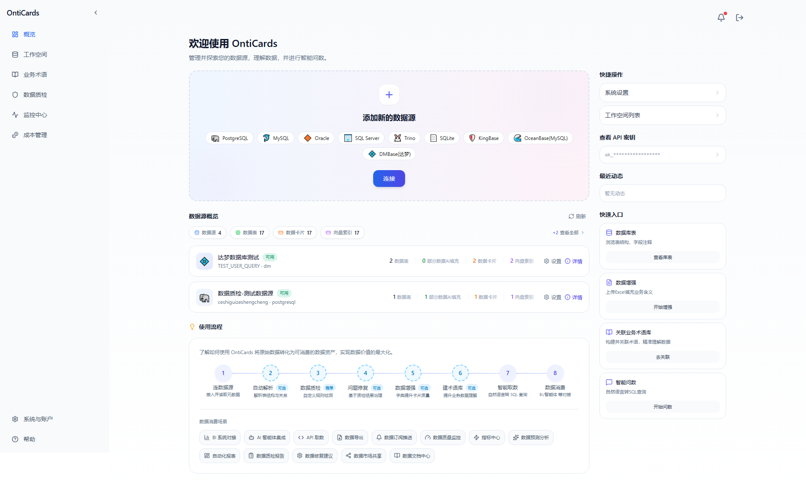

首页包含以下区域：

- **添加数据源快捷入口**：提供 8 种主流数据库的连接卡片（PostgreSQL、MySQL、Oracle、SQL Server、Trino、SQLite、KingBase、OceanBase(MySQL)、DMBase(达梦)），点击「连接」按钮直接进入新建数据源流程
- **数据源概览**：顶部展示当前账号下数据源总数、数据表总数、数据卡片总数、向量索引数等核心指标
- **数据源列表**：展示已添加的所有数据源卡片，显示连接状态、数据表数、数据卡片数、最后更新时间
- **使用流程**：以 8 步流程图展示完整使用路径（连数据源 → 自动解析 → 数据增强 → 问题修复 → 数据增强 → 建术语库 → 智能取数 → 数据治理）
- **数据流通场景**：展示 B 系统对接、API 取数、数据导出、数据订阅读取、数据质量监控、指标中心、数据预览等典型场景
- **快捷操作区（右侧）**：系统设置、工作空间列表、查看 API 密钥、最近动态

### 2.3 首次使用流程

推荐的首次使用流程：

```
登录系统
   ↓
[必选] 添加数据源
   ↓
[自动] 系统生成数据卡片
   ↓
[推荐] 字段注释增强（上传 Excel 字典）
   ↓
[推荐] 创建并启用业务术语库
   ↓
[推荐] 启动数据盘点（全域或定向）
   ↓
开始自然语言问数
   ↓
[按需] 配置数据质检规则 → 启动执行
   ↓
[按需] 监控查询情况、查看历史与成本
```

> ⏱️ 完成前 4 步（登录、添加数据源、生成卡片、补充术语）通常 30 分钟内即可上手问数。

---

## 三、工作空间（数据源管理）

「工作空间」是 OntiCards 中管理所有数据源的中心。

### 3.1 工作空间总览

进入「工作空间」后看到所有已添加的数据源。

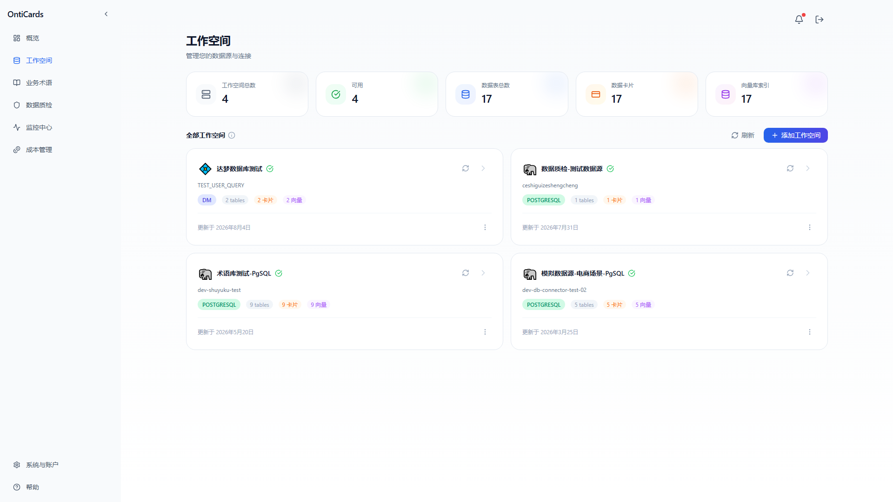

**顶部指标卡**：

| 指标     | 含义                      |
| ------ | ----------------------- |
| 工作空间总数 | 当前账号下已添加的数据源数量          |
| 可用     | 状态为「可用」的数据源数量           |
| 数据表总数  | 所有数据源下的表/视图总数量          |
| 数据卡片   | 已生成的智能数据卡片数量            |
| 向量索引   | 已建好的向量索引数（用于 NL2SQL 检索） |

**数据源卡片**展示每个数据源的：

- 数据库类型标签（POSTGRESQL、DM、ORACLE 等）
- 名称与英文别名
- 数据库类型图标
- 表数量、卡片数、向量索引数
- 状态（可用 / 异常）
- 最后更新日期
- 操作按钮：刷新、设置、详情

### 3.2 添加数据源

**步骤 1：进入添加表单**

在「工作空间」页或「概览」页点击「连接」按钮（位于添加数据源快捷区或右上角），弹出添加数据源对话框。

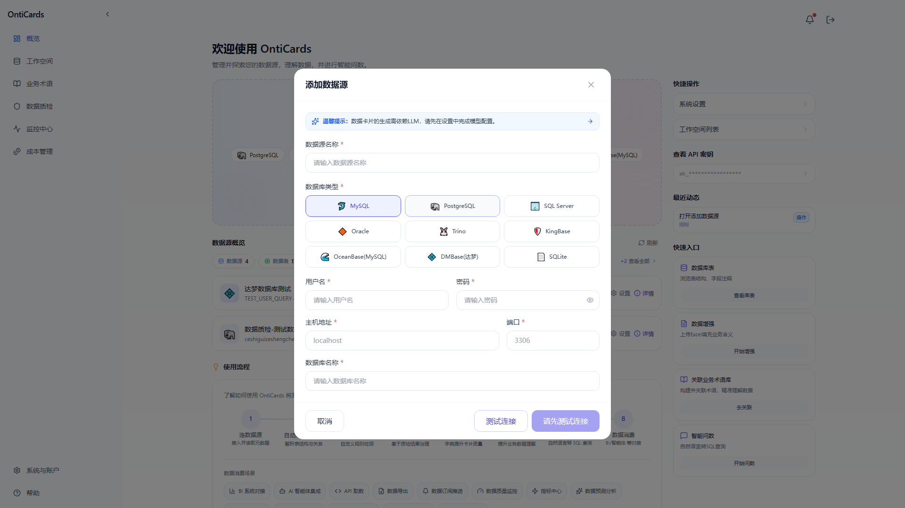

**步骤 2：填写连接信息**

| 字段      | 说明              | 示例              |
| ------- | --------------- | --------------- |
| 数据源名称 * | 便于识别的业务名称       | `电商生产库`         |
| 数据源类型 * | 9 种数据库类型可选      | MySQL           |
| 用户名 *   | 拥有 SELECT 权限的账号 | `readonly_user` |
| 密码 *    | 对应账号的密码         | `******`        |
| 主机地址 *  | 数据库服务器 IP 或域名   | `192.168.1.100` |
| 端口 *    | 数据库监听端口         | `3306`          |
| 数据库名 *  | 具体要接入的库         | `ecommerce`     |

**步骤 3：测试连接**

点击「测试连接」，系统会验证：

- 网络可达性
- 账号密码正确性
- 目标库存在性
- 必要权限（SELECT）

测试通过后按钮变为「请先测试连接」可继续点击保存。

**步骤 4：保存**

点击「请先测试连接」变为「保存」后提交，系统会：

1. 写入数据源元数据
2. 自动拉取所有表与字段信息
3. 自动启动 **数据卡片生成任务**（异步执行）
4. 写入「任务」标签，可在「任务」页查看进度

> 🔐 **重要**：为安全起见，建议使用 **仅具备 SELECT 权限的只读账号**。OntiCards 不执行任何 DML/DDL 操作。

### 3.3 支持的数据库类型

| 数据库               | 类型   | 备注                   |
| ----------------- | ---- | -------------------- |
| MySQL             | 开源   | 主流数据库，5.7+           |
| PostgreSQL        | 开源   | 10+，兼容人大金仓（KingBase） |
| Oracle            | 商业   | 11g+                 |
| SQL Server        | 商业   | 2012+                |
| Trino             | OLAP | 大数据查询引擎              |
| SQLite            | 轻量   | 测试/小规模               |
| KingBase          | 国产   | 电科金仓                 |
| OceanBase (MySQL) | 国产   | 蚂蚁分布式数据库（MySQL 租户）   |
| DMBase（达梦）        | 国产   | 武汉达梦，V8              |

### 3.4 刷新数据源

当数据库结构发生变化（新增表、新增/修改字段）时，需要刷新：

1. 在数据源卡片右上角点击「刷新」图标
2. 系统增量识别变化的表与字段
3. 对新增的表自动启动数据卡片生成
4. 已有的卡片会保留人工编辑结果

> 💡 智能增量识别：仅重生成有变化的表，避免大库刷新耗时。

### 3.5 删除数据源

1. 在数据源卡片右上角「...」菜单中点击「删除」
2. 弹出确认对话框
3. 确认后该数据源及其所有数据卡片、历史查询将被清除

> ⚠️ 删除操作 **不可逆**。如担心误删，可先将数据源标记为「停用」（如有此权限）。

---

## 四、数据源详情

点击数据源卡片任意位置，即可进入该数据源的详情页。

详情页包含以下顶部信息和 8 个功能 Tab：

**顶部信息**：

- 数据源名称、连接状态徽标
- 数据表数、数据卡片数、向量索引数、最后更新时间
- 「设置」按钮：进入数据源配置
- 「执行盘点」按钮：快速启动数据盘点任务

**8 个功能 Tab**：

| Tab | 用途                |
| --- | ----------------- |
| 概览  | 数据源概览、连接信息、表与卡片统计 |
| 库表  | 浏览所有表与字段、查看详情     |
| 卡片  | 浏览/管理智能数据卡片       |
| 增强  | 通过 Excel 上传补充字段注释 |
| 问数  | 自然语言查询入口          |
| 知识  | 该数据源关联的业务术语库      |
| 历史  | 该数据源的历史查询记录       |
| 任务  | 数据盘点任务（定向/全域）     |

### 4.1 概览

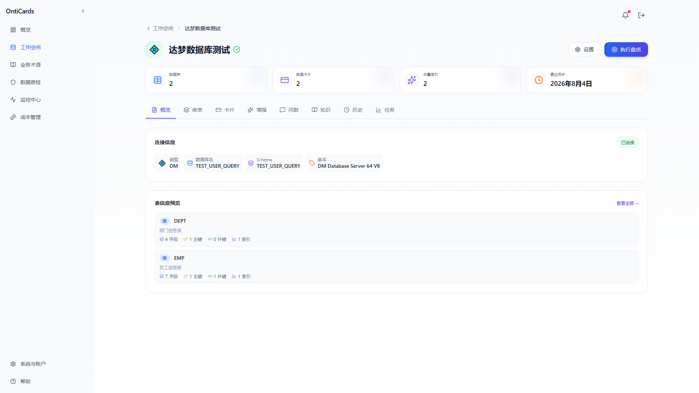

展示：

- **连接信息**：类型、数据名、Schema、版本
- **表与卡片完成情况**：列出所有表，每张表显示"已生成/未生成"卡片状态
- **表内字段分布**：主键、外键、索引数

### 4.2 库表

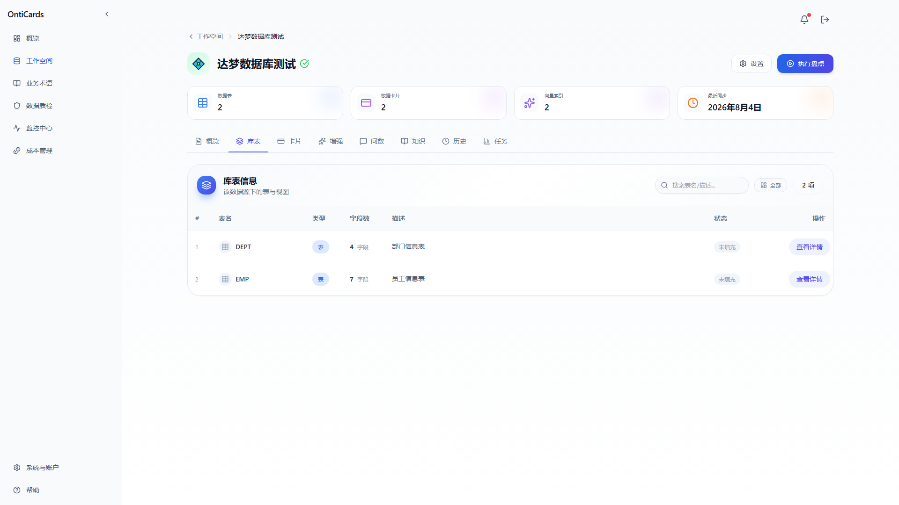

该 Tab 列出该数据源下的所有表与视图：

- **表名**：默认以数据库原名展示
- **类型**：表（TABLE）/ 视图（VIEW）
- **字段数**：每张表的字段数量
- **描述**：自动生成的表业务描述
- **状态**：卡片是否已生成（已填充 / 未填充）
- **操作**：查看详情、生成/重新生成数据卡片

**点击表名或「查看详情」**：

可进入表详情页，浏览：

- 表的完整字段列表（字段名、类型、是否主键、是否可空、默认值、注释）
- 字段与数据卡片的对应关系
- 字段在示例查询中的常见用法

### 4.3 卡片（数据卡片）

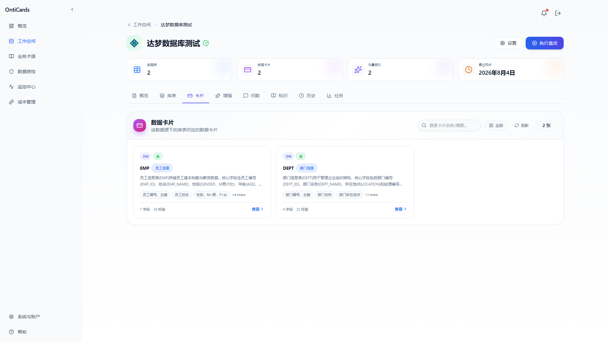

数据卡片是 OntiCards 最重要的元数据资产之一。系统会为每张表自动生成一张"业务说明书"。

**卡片列表**展示该数据源下所有表的数据卡片，每张卡片显示：

- 数据库类型徽标
- 表名（如 `EMP`、`DEPT`）
- 业务描述（自动摘要）
- 关键字段标签
- 字段数与注释数（如 `7 字段 / 21 标签`）

**点击「查看」** 进入卡片详情：

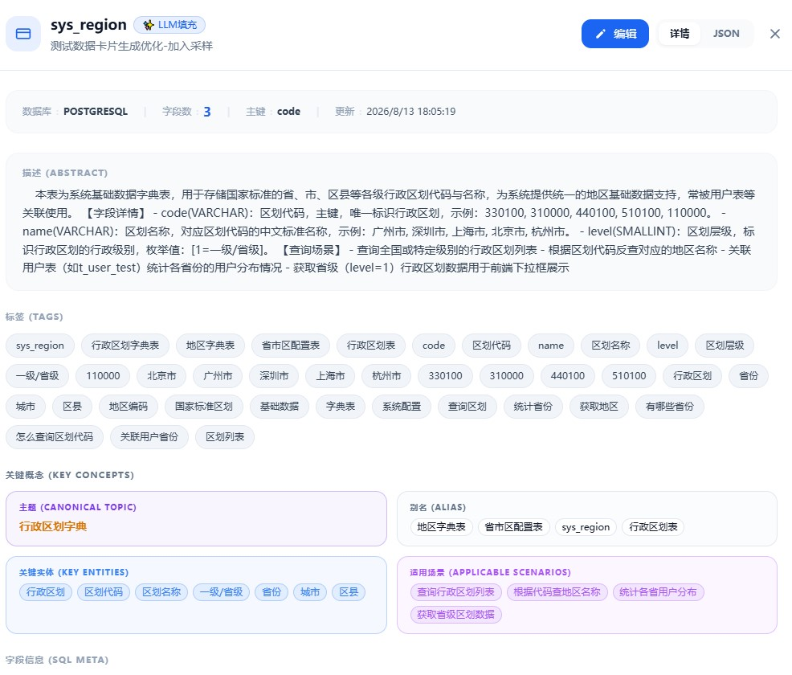

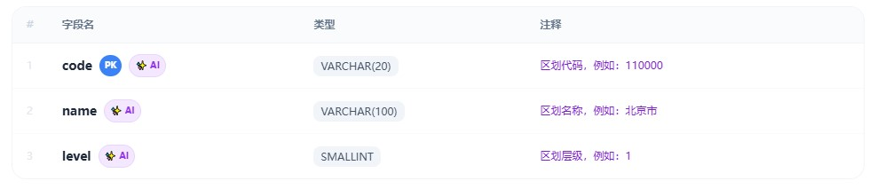

一张完整的数据卡片包含 **6 个核心模块**，以 `sys_region`（行政区划字典表）为例：

| 模块                             | 内容                       | 实例                                                                            |
| ------------------------------ | ------------------------ | ----------------------------------------------------------------------------- |
| **ABSTRACT（描述）**               | 表的业务用途说明 + 字段逐项解释 + 查询场景 | 系统基础数据字典表，用于存储国家标准省/市/区县代码与名称；字段 `code` 为主键唯一行政区代码，`name` 为区划名称，`level` 为区划层级 |
| **TAGS（标签）**                   | 自动打上的字段标签与业务词            | `sys_region`、`行政区划字典表`、`主键`、`code`、`北京市` `广州市` `上海市` 等枚举值                     |
| **KEY CONCEPTS（关键概念）**         | 表的主题与别名                  | 主题：**行政区划字典**；别名：地区字典表、省市区配置表、行政区列表                                           |
| **KEY ENTITIES（关键实体）**         | 表涉及的业务实体类型               | 行政区划、区划代码、区划名称、一级/省级、省份、城市、区县                                                 |
| **APPLICABLE SCENARIOS（适用场景）** | 该表适合回答的业务问题              | 查询行政区划列表、根据代码查地区名称、统计各省用户分布、获取省区划数据                                           |
| **SQL META（元数据）**              | 字段名、类型、注释的完整列表           | 其他详情信息底部                                                                      |

**关于「LLM 填充」徽标**：

- 卡片标题旁的 🪄 **LLM 填充** 标识表示该卡片由大模型自动生成
- **人工编辑** 后的卡片会自动取消该徽标，刷新数据源时不会被覆盖
- 「JSON」标签可查看卡片结构化数据，便于与外部系统对接

**人工编辑**：

点击「编辑」按钮可以人工修正：

- 调整表描述
- 修改/新增字段注释
- 增删标签
- 增删关键概念
- 增删适用场景

> 💡 **小技巧**：人工编辑后的卡片会被锁定，刷新数据源时不会被覆盖。系统也支持「重新生成」操作。

### 4.4 增强（字段注释增强）

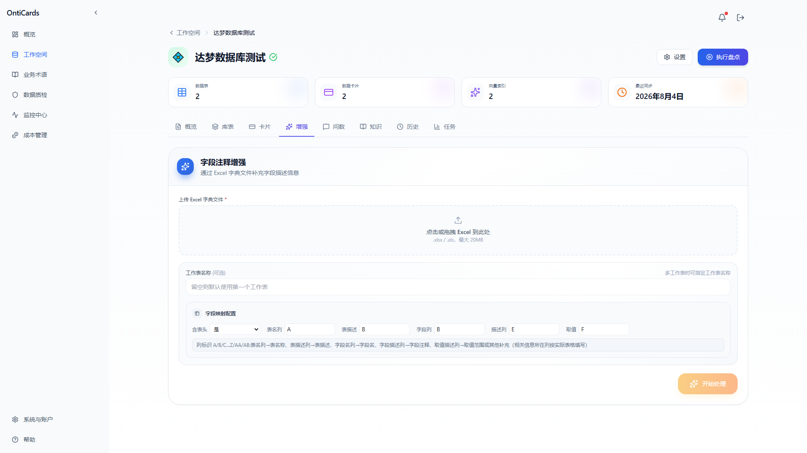

「增强」Tab 用于 **通过 Excel 字典批量补充字段注释**，适合以下场景：

- 系统自动生成的注释不够准确
- 企业有现成的业务数据字典 Excel 文件
- 业务专家需要批量补全大量字段

**使用流程**：

1. 准备一个 Excel 文件（.xlsx / .xls），最大 20MB
2. 第一个工作表将被作为默认字典表
3. 配置列映射：选择哪一列是表名、字段名、字段注释
4. 点击「开始处理」
5. 处理完成后，对应字段的注释会写入数据卡片

> 💡 Excel 列映射可灵活配置（表名/字段名/字段注释对应的列），并支持一张工作表包含多个表名（不同行）。

### 4.5 问数（智能问数）

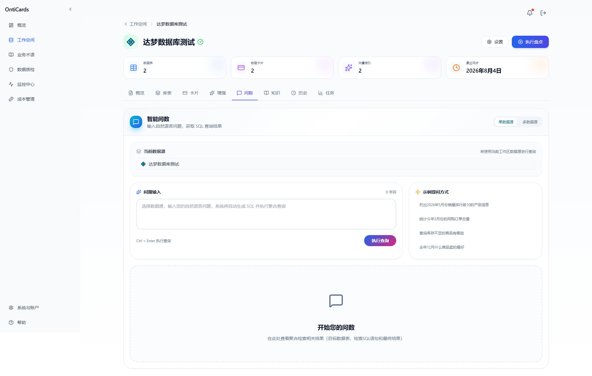

**问数**是 OntiCards 的核心交互入口。在该 Tab 下：

**左侧主区域**：

- **问题输入框**：支持多行输入，按 `Ctrl + Enter` 换行
- **「执行查询」按钮**：提交自然语言问题
- **模式切换**：「单数据源」/「多数据源」

**当前数据源卡片**：明确显示本次查询作用于哪个数据源

**示例问题区**（右侧「示例问句方式」）：点击即可填入示例问题，快速体验。

**多数据源模式**：

切换到「多数据源」后，可同时勾选多个数据源，系统会：

1. 理解问题
2. 自动规划需要查询哪些数据源
3. 跨库查询后对齐字段
4. 合并呈现结果

**实际问数示例**：

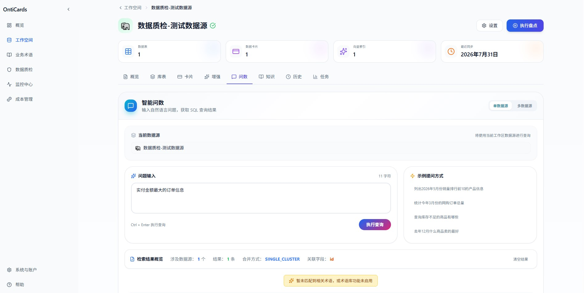

如上图所示，在「数据质检-测试数据源」下提问「实付金额最大的订单信息」：

- **顶部统计**：数据表/卡片/问数单/最近问数 4 个概览指标
- **来源选择**：明确告诉系统本次查询作用于哪个数据源
- **问题输入区**：右下角带快捷键提示 `Ctrl + Enter`
- **右侧示例**：点击示例问题即可快速填入
- **检索结果概览**：底部显示涉及数据源数、结果条数、合并方式、关键字段

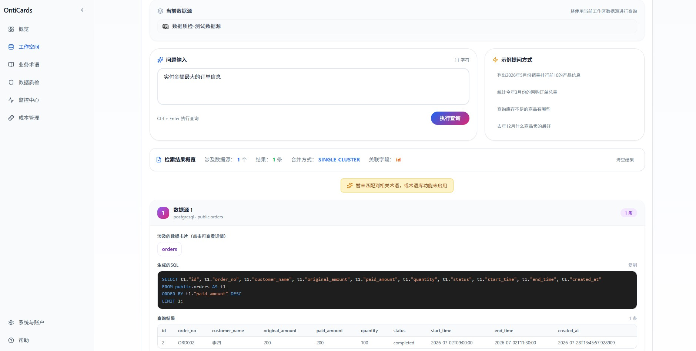

如上图所示，问数结果区主要由 4 块组成：

| 区块                | 说明                                                                     |
| ----------------- | ---------------------------------------------------------------------- |
| **检索结果概览**        | 展示 `涉及数据源 1 个 / 结果 1 条 / 合并方式 SINGLE_CLUSTER / 关键字段 id`，右侧提供「清空结果」快捷操作 |
| **关联数据源**         | 命中卡片 `public.orders`，右侧 `1条` 角标提示命中数量                                  |
| **生成 SQL**（暗色代码块） | 完整可复制，并在底部显示「暂未匹配到相关术语库」提示                                             |
| **查询结果表**         | 表格化展示返回的字段值，最右列提供「复制 / 解释」动作                                           |

### 4.6 知识（业务术语库）

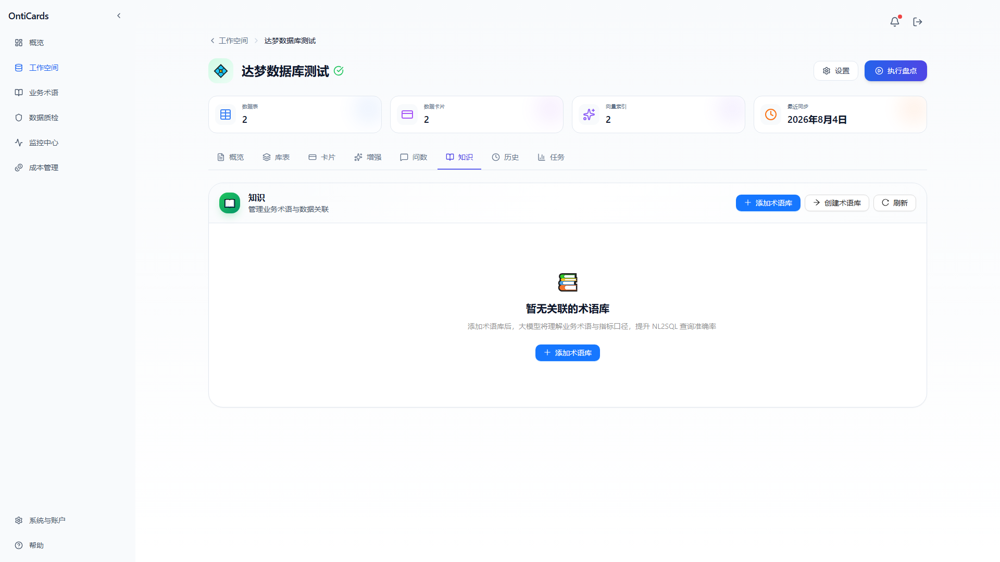

「知识」Tab 用于 **管理与该数据源关联的业务术语库**：

- 显示该数据源已关联的术语库列表
- 提供「添加术语库」「创建术语库」「刷新」操作
- 当数据源还没有关联任何术语库时，会以空状态引导

> 📚 业务术语库的具体创建与管理见 [第六章 业务术语库](#六业务术语库)。

### 4.7 历史（历史查询）

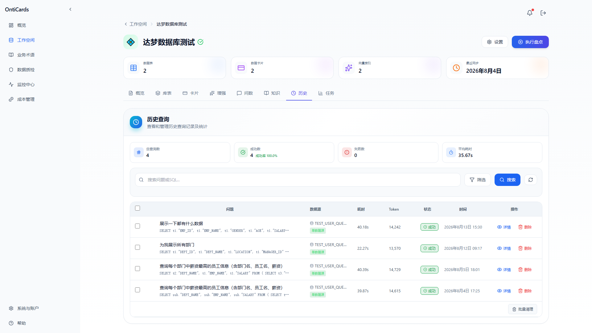

「历史」Tab 展示该数据源下的所有历史查询记录：

**顶部统计**：总查询数、成功率、失败数、平均耗时

**筛选与搜索**：

- 搜索框：按问题关键词或生成的 SQL 片段搜索
- 「筛选」按钮：按时间范围、数据表、状态筛选
- 「搜索」按钮：执行筛选
- 「导出」按钮：导出当前结果

**查询记录列表**：

| 列     | 说明                   |
| ----- | -------------------- |
| 问题    | 用户输入的自然语言问题          |
| 数据源   | 涉及的数据源               |
| 耗时    | 本次查询的总耗时（毫秒）         |
| Token | 消耗的 Token 数量         |
| 状态    | 成功 / 失败 / 超时         |
| 时间    | 提问时间                 |
| 操作    | 详情（查看完整 SQL 与结果）/ 删除 |

**点击「详情」**&#x67E5;看：

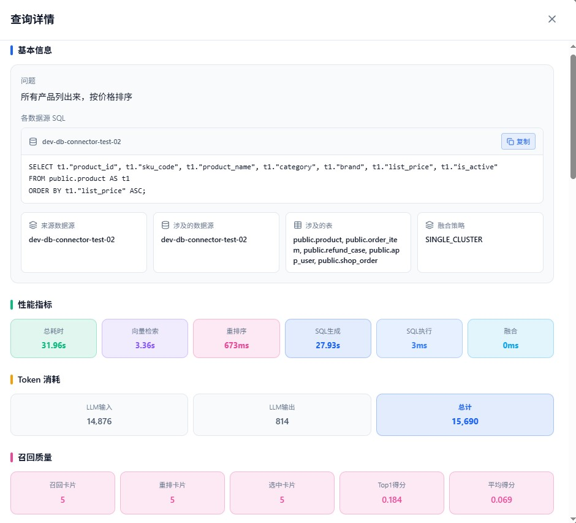

查询详情面板包含 6大块信息：

**① 基本信息**

- 原始问题（如"所有产品列出来，按价格排序"）
- 备数据源信息
- 生成的完整 SQL（带「复制」按钮）
- 来源 / 涉及的数据源
- 涉及的表清单
- 融合策略（如 `SINGLE_CLUSTER` / `MULTI_CLUSTER`）

**② 性能指标**

| 指标     | 含义               |
| ------ | ---------------- |
| 总耗时    | 从问题提交到结果返回的端到端耗时 |
| 向量检索   | 召回数据卡片 / 表的耗时    |
| 重排序    | 对召回结果重排序的耗时      |
| SQL 生成 | LLM 生成 SQL 的耗时   |
| SQL 执行 | 在数据库执行 SQL 的耗时   |
| 融合     | 跨源结果对齐与合并耗时      |

**③ Token 消耗**

- LLM 输入 Token
- LLM 输出 Token
- 总计

> 💡 监控每次问数的 Token 消耗有助于成本管理（详见 [第十一章 成本管理](#十一成本管理)）。

**④ 召回质量**

| 指标      | 含义                    |
| ------- | --------------------- |
| 召回数     | 候选表 / 卡片总数            |
| 重排数     | 经重排序后的候选数             |
| 选中数     | 最终被采纳的表 / 卡片数         |
| Top1 得分 | 排名第一的候选与问题的语义相关度（0~1） |
| 平均得分    | 全部候选的平均相关度            |

> 🎯 Top1 得分 < 0.5 通常表示问题表述不够清晰或业务术语未覆盖，可结合 [第五章 优化查询结果](#55-优化查询结果) 的建议调整。

**⑤ 涉及的数据卡片**：点击后可查看数据卡片的详情信息

**⑥ 查询结果记录**：本次查询的结果（表格形式呈现）

### 4.8 任务（数据盘点）

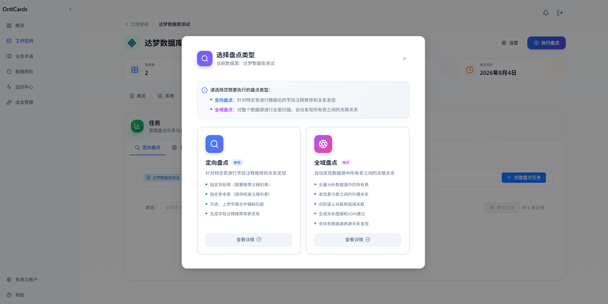

「任务」Tab 或右上角的「执行盘点」按钮用于管理与启动 **数据盘点任务**。其会分析表与表之间的关联关系，结果会用于：

- 提升多表 JOIN 查询的准确率
- 自动生成关系卡片
- 发现潜在的数据关系

支持两种盘点模式：

- **定向盘点**：选择目标表与参考表，做精细化盘点
- **全域盘点**：对全库所有表做整体盘点

**创建定向盘点任务**：

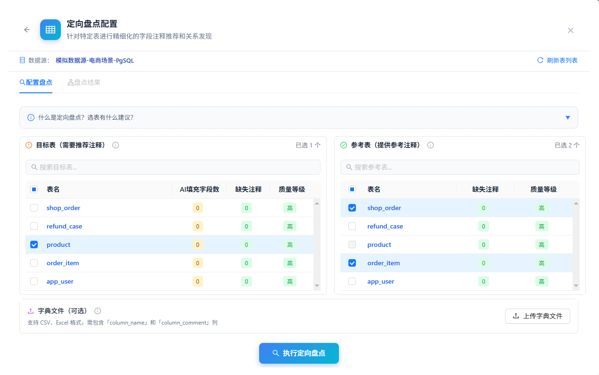

操作步骤：

1. 点击「创建盘点任务」进入「定向盘点配置」页面
2. 在「目标表（需要推荐注释）」区勾选需要补充关系的表（如 `product`）
3. 在「参考表（提供参考注释）」区勾选提供候选关系的表（如 `shop_order`、`order_item`）
4. （可选）上传字典文件（CSV / Excel 格式，需包含 `column_name` 与 `column_comment` 列）
5. 点击「执行定向盘点」，系统开始分析

**查看盘点结果·表关系确认**：

盘点完成后进入「盘点结果」Tab，可查看系统推荐的关系列表：

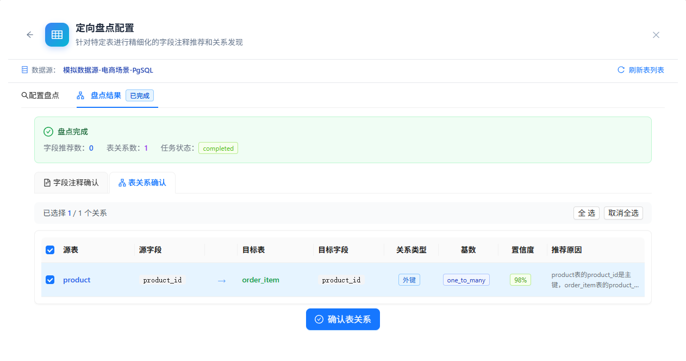

| 字段         | 说明                                 |
| ---------- | ---------------------------------- |
| 源表 / 源字段   | 已知的关联起点（如 `product.product_id`）    |
| 目标表 / 目标字段 | 候选的关联终点（如 `order_item.product_id`） |
| 关系类型       | 外键 / 同名字段 / 业务关联                   |
| 基数         | `one_to_one` / `one_to_many` 等     |
| 置信度        | 系统对这条关系推荐的可信度（0~100%）              |
| 推荐原因       | 模型给出的判定理由                          |

> ✅ 勾选确认无误的关系，点击「确认表关系」即可生成 **关系卡片**。

**盘点结果·关系图谱视图**：

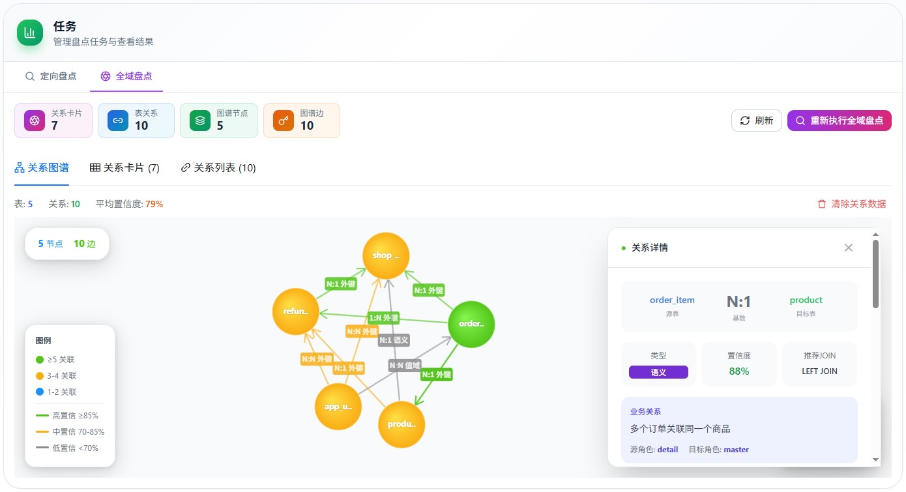

在「盘点结果」Tab 切换至「关系图谱」子视图，可以更直观地看到表与表之间的 **关系连线** 和整体连接关系，便于从全局理解数据模型。

**关系卡片详情**：

点击某条已确认关系，可进入「关系卡片」详情页：

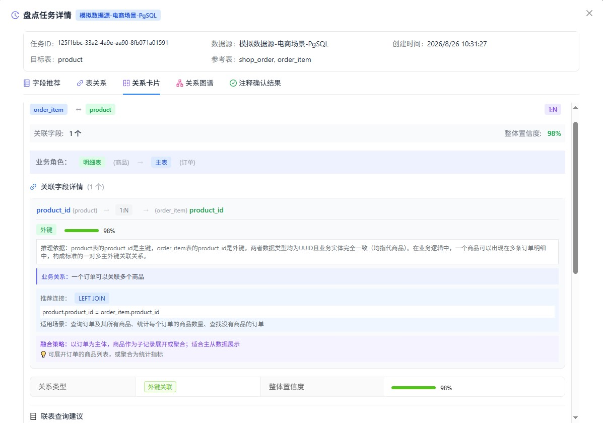

关系卡片以 **业务语言** 解释一条关系的含义，包括：

- **关联字段**：参与关联的字段（如 `product.product_id` ↔ `order_item.product_id`）
- **业务含义**：用自然语言解释"为什么这两张表能这样连"
- **业务角色**：明确主表（商品）与从表（订单）的角色划分
- **关系类型**：外键关联 / 同名字段 / 业务推断
- **推荐连接**：`LEFT JOIN` / `INNER JOIN` / 全连接
- **推荐依据**：模型给出该推荐的原因（如字段类型一致、值域分布匹配等）
- **整体置信度**：模型对该关系的总体评分（如 98%）
- **适用场景**：这条关系适合回答什么类型的业务问题
- **融合策略建议**：基于主从数据展示的预聚合建议
- **联表查询建议**：可直接套用的 SQL 模板

> 🔍 数据盘点的更多操作细节见 [第七章 数据盘点](#七数据盘点)。

---

## 五、智能问数（自然语言查询）

### 5.1 基本查询

在「问数」Tab 的输入框中输入日常问题，例如：

- 列出 2025 年 5 月份销售排行榜前 10 的产品信息
- 统计今年 3 月份各部门的订单总量
- 查询库存不足的商品有哪些
- 去年 12 月份什么商品卖得最好

按回车或点击「执行查询」，系统会：

1. **理解问题**：识别意图、涉及的时间范围、维度、指标
2. **检索元数据**：匹配相关表与字段
3. **生成 SQL**：根据数据库方言生成可执行 SQL
4. **安全校验**：拦截非 SELECT 语句
5. **执行查询**：执行 SQL 并返回结果
6. **结果展示**：以表格、图表形式展示

### 5.2 多步推理查询

OntiCards 支持 **多步推理**（Multi-step Reasoning）。系统会将复杂问题拆解为多个子问题，依次执行后合并结果。

**示例问题**：

> "查询上月销量前 10 的商品，这些商品目前的库存分别是多少？"

系统会拆解为：

1. 取上月销量前 10 的商品
2. 查这 10 个商品的当前库存
3. 合并两张结果

### 5.3 跨源融合查询

**前置条件**：

- 已添加多个数据源
- 业务术语库已配置并启用
- 切换到「多数据源」模式

**示例问题**：

> "电商系统的订单与 CRM 的客户档案对比，找出哪些 VIP 客户最近 3 个月未下单？"

系统会：

1. 解析出需要查「订单库」与「CRM 库」
2. 在订单库中找最近 3 个月的订单
3. 在 CRM 库中找 VIP 客户
4. 跨库对齐结果

**跨库查询示例**（输入阶段）：

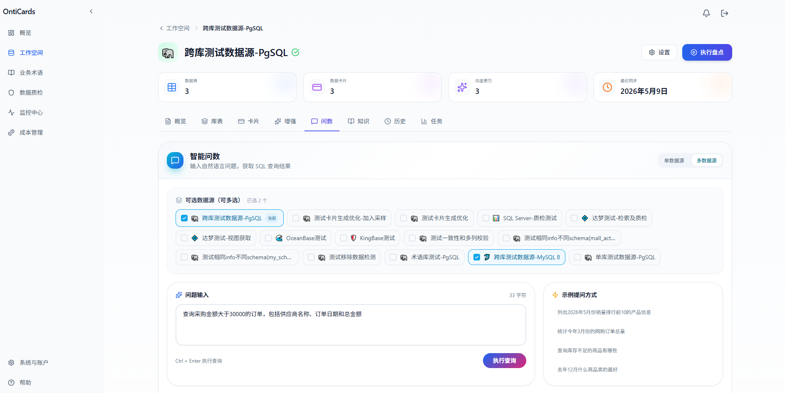

如上图所示：

- **顶部统计区**：数据表 3 张 / 数据卡片 3 张 / 问数单 3 个 / 最近同步 2026 年 5 月 9 日
- **多数据源开关**：「多数据源」已启用（单数据源 → 多数据源 一键切换）
- **可选数据源**（多选）：共 14 个数据源可勾选，已选 2 个（高亮态）
- **问题输入区**：提问「查询采购金额大于30000的订单，包括供应商名称、订单日期和总金额」33 字符
- **示例问句方式**（右侧）：点击可快速填入问题

**跨库查询结果融合**（输出阶段）：

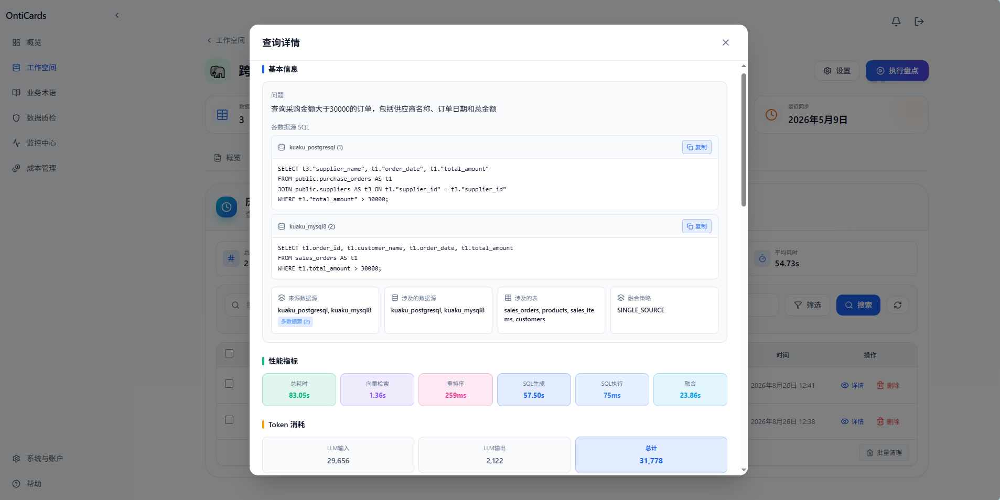

查询详情弹窗内清晰展示 **跨源融合** 的全链路：

| 区块               | 关键内容                                                                                                                                          |
| ---------------- | --------------------------------------------------------------------------------------------------------------------------------------------- |
| **基本信息**         | 用户问题、查看数据 SQL                                                                                                                                 |
| **各数据源 SQL**（双段） | - `kuaku_postgresql`：`purchase_orders` JOIN `suppliers`，筛选 `total_amount > 30000`  
\- `kuaku_mysql`：`sales_orders` 筛选 `total_amount > 30000` |
| **关联信息 4 卡**     | 来源数据源 / 关联数据源 / 涉及表（`purchase_orders` + `suppliers` + `sales_orders` + `products` + `customers`）/ 融合指标 `SINGLE_SOURCE`                        |
| **性能指标**         | 总耗时 `83.05s` / 向量检索 `1.36s` / 重排序 `259ms` / SQL 生成 `57.50s` / SQL 执行 `75ms` / 融合 `23.86s`                                                     |
| **Token 消耗**     | LLM 输入 `29,656` / LLM 输出 `2,122` / 总计 `31,778`                                                                                                |

> 💡 跨库查询的融合方式（`SINGLE_SOURCE` / `MULTI_CLUSTER` / `JOIN_FUSION` 等）由系统根据问题复杂度自动选择，结果详情中可清晰看到每一步耗时。

### 5.4 查询结果解读

查询结果页通常包含以下信息：

- **数据表格**：查询返回的核心数据
- **数据来源**：明确标注来自哪个数据库、哪些表
- **查询说明**：系统是如何理解你问题的，包括：
  - 识别到的时间范围
  - 识别的筛选条件
  - 选择的表与字段
  - 应用的业务术语
- **生成的 SQL**：可一键复制
- **提示与告警**：哪些条件被识别、哪些被忽略、原因是什么

**实际查询结果示例**：

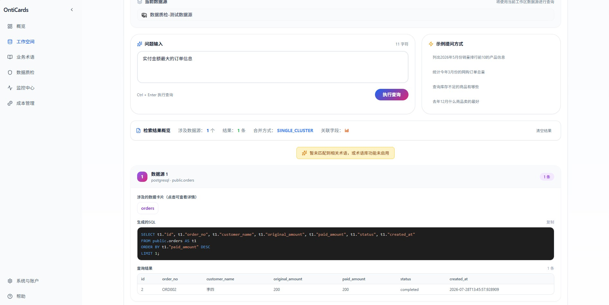

如上图所示，提问「实付金额最大的订单信息」后，系统返回：

- **检索结果概览**：涉及 1 个数据源，返回 1 条结果，合并方式 `SINGLE_CLUSTER`，关键字段 `id`
- **数据源 1**（1 条）：关联的卡片为 `public.orders`
- **生成 SQL**（高亮代码块，可一键复制 / 复制 / 解释）：
  ```sql
  SELECT t1."id", t1."order_no", t1."customer_name",
         t1."original_amount", t1."paid_amount",
         t1."status", t1."created_at"
  FROM public.orders AS t1
  ORDER BY t1."paid_amount" DESC
  LIMIT 1;
  ```
- **查询结果表**：展示关键字段值（`id` / `order_no` / `customer_name` / `original_amount` / `paid_amount` / `status` / `created_at`）

> 💡 未配置相关术语库时，系统会在底部给出提示「暂未匹配到相关术语库，或术语库功能未启用」，可按需去 [第六章 业务术语库](#六业务术语库) 创建。

### 5.5 优化查询结果

如果结果不符合预期，按以下顺序排查：

1. **查看「查询说明」**：理解系统的解析逻辑
2. **补充数据卡片**：表与字段的描述越丰富，问数越准确（可手动调整或上传字典文件）
3. **补充业务术语库**：把"高价值客户"等业务概念显式定义，助于系统理解专业术语名词
4. **调整提问方式**：更具体地表达意图
   - 增加时间范围限定
   - 明确排序方式
   - 明确输出格式
5. **启用数据盘点**：补充表之间的关系，提升 JOIN 准确率

**提问技巧**：

| 场景   | 不好的问法   | 好的问法            |
| ---- | ------- | --------------- |
| 时间范围 | "最近的订单" | "最近 30 天的订单"    |
| 排序   | "最多的客户" | "消费金额前 10 名的客户" |
| 维度   | "产品的销售" | "按品类分组的销售总额"    |
| 过滤   | "活跃用户"  | "近 7 天登录过的用户"   |

---

## 六、业务术语库

### 6.1 什么是业务术语库

业务术语库（Glossary）用于 **把企业内部的业务概念显式定义**，让系统真正"懂业务语言"。

**典型例子**：

| 业务术语  | 系统理解                                    |
| ----- | --------------------------------------- |
| 高价值客户 | `VIP等级 IN ('钻石','金卡') AND 累计消费 > 10000` |
| 核心商品  | `产品分类 IN ('A类','B类')`                   |
| 活跃用户  | `最近 30 天登录次数 >= 3`                      |
| 滞销商品  | `入库超过 90 天 且 销量 < 10`                   |

### 6.2 创建术语库

进入「业务术语」页面：

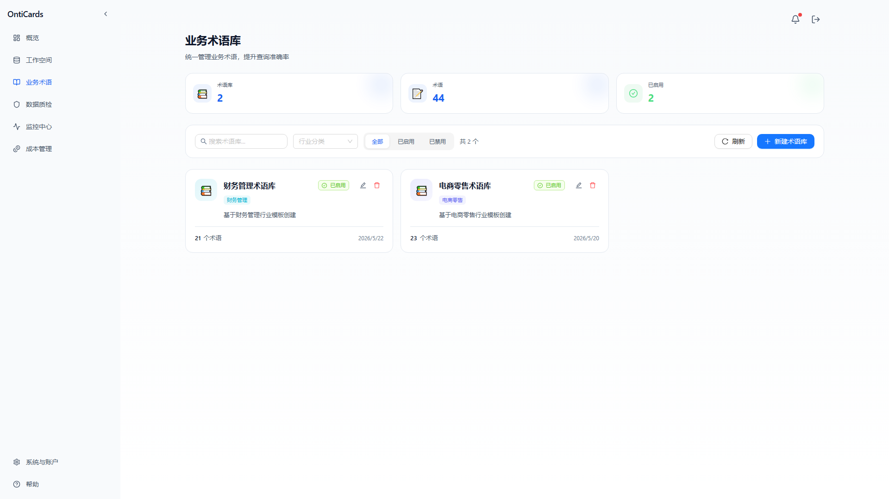

**步骤**：

1. 点击「新建术语库」按钮
2. 填写：
   - 术语库名称（如"销售术语库"）
   - 行业分类（可选）
   - 描述（说明该术语库的应用范围）
3. 在术语库内添加业务术语，每条术语包含：
   - **术语名称**：业务口径（如"高价值客户"）
   - **别名/同义词**：可选（如"VIP 客户""重点客户"）
   - **定义**：用 SQL 表达式或自然语言定义
   - **关联字段**：关联到具体的库.表.字段
4. 启用术语库（开关开启后，问数时才会被使用）

> 💡 系统提供"财务术语库""电商零售术语库"等行业模板，可作为起点。

**术语库详情示例（财务术语库）**：

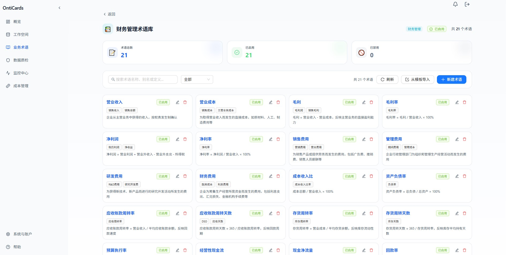

如上图所示，进入「财务术语库」后可看到完整的术语卡片列表，每张卡片包含：

- **术语名称**：如「营业收入」「营业成本」「毛利」「毛利率」「净利润」等
- **状态徽标**：「已启用」/「已停用」一键切换
- **别名 / 同义词**：支持多个（如「毛利润」对应「毛利」）
- **类型标签**：标记该术语的种类（销售类 / 成本类 / 费用类 / 资产类 / 风险类等）
- **定义**：用自然语言 + 公式（如「毛利率 = 毛利 / 营业收入 × 100%」）

**常用财务术语速查**：

| 分类  | 术语    | 系统理解                                |
| --- | ----- | ----------------------------------- |
| 收入类 | 营业收入  | 企业从经营业务中获得的收入，按权责发生制确认              |
| 收入类 | 营业成本  | 为取得营业收入而发生的直接成本，如原材料、人工、制造费用等       |
| 利润类 | 毛利    | 营业收入 − 营业成本，反映主营业务的盈利能力和直接成本控制水平    |
| 利润类 | 毛利率   | 毛利 / 营业收入 × 100%                    |
| 利润类 | 净利润   | 营业收入 − 营业成本 − 营业外收入 − 营业外支出 − 所得税费用 |
| 利润类 | 净利率   | 净利润 / 营业收入 × 100%                   |
| 费用类 | 销售费用  | 为销售产品或提供劳务而发生的费用，包括广告费、推销员工资、销售机构经费 |
| 费用类 | 管理费用  | 企业行政管理为生产经营活动所发生的费用                 |
| 风险类 | 资产负债率 | 总负债 / 总资产 × 100%                    |
| 流动性 | 现金净流量 | 现金流入 − 现金流出                         |

### 6.3 在数据源中关联术语库

创建好的术语库需要 **关联到具体数据源** 才会被使用。

1. 进入数据源详情 → 「知识」Tab
2. 点击「添加术语库」
3. 选择目标术语库
4. 关联后，该数据源的所有问数都会自动展开该术语库中的概念

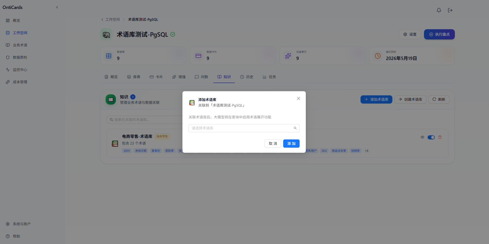

---

## 七、数据盘点

数据盘点是 **AI 自动分析表与表之间关系** 的能力，能显著提升多表 JOIN 查询的准确率。

### 7.1 全域盘点

适用场景：首次接入数据源，希望系统自动发现所有表的关系。

**步骤**：

1. 进入数据源详情 → 「任务」Tab
2. 选择「全域盘点」模式
3. 点击「创建盘点任务」
4. 等待系统完成（表数越多耗时越长）
5. 在任务列表中查看进度与结果
6. 完成后系统会生成 **关系卡片**，并自动应用到问数引擎

### 7.2 定向盘点

适用场景：

- 只想盘点几张核心业务表
- 系统推荐的关系不准确，需要补充参考
- 人工对部分表有明确的关系预期

**步骤**：

1. 进入「任务」Tab → 「定向盘点」
2. 选择 **目标表**（需要补充关系的表）
3. 选择 **参考表**（提供候选关系的表）
4. （可选）上传字典文件辅助字段推荐
5. 点击「执行定向盘点」
6. 系统会分析并推荐字段间的关系
7. 人工确认 / 修正后点击「确认表关系」生成 **关系卡片**

> 📌 配置页与盘点结果视图的详细说明见 [§4.8 任务（数据盘点）](#48-任务数据盘点)。

### 7.3 盘点结果管理

盘点完成后，系统会生成两类核心产物：

- **关系列表**（表关系确认视图）：列出全部候选关系，可逐条勾选确认
- **关系卡片**：每条确认的关系都会生成一张「关系卡片」，用于问数时自动调用

**关系卡片生命周期**：

1. **生成**：盘点结果确认后自动产出
2. **应用**：在问数涉及相关表时被自动召回
3. **编辑**：支持人工微调（业务含义、推荐连接、置信度等）
4. **回滚**：关系错误时可删除并重新盘点

> 📌 关系卡片详情与字段说明见 [§4.8 任务（数据盘点）](#48-任务数据盘点)。

---

## 八、字段注释增强

当 AI 自动生成的数据卡片描述不够准确时，可通过 **上传 Excel 数据字典** 的方式批量补充字段注释。

### 8.1 准备 Excel 字典文件

**要求**：

- 文件格式：`.xlsx` 或 `.xls`
- 文件大小：≤ 20MB
- 默认读取 **第一个工作表**
- 必须包含表名、字段名、字段注释三列（顺序不限，可在上传时映射）

**示例**：

| 表名     | 字段名        | 字段注释     |
| ------ | ---------- | -------- |
| orders | order_id   | 订单编号（主键） |
| orders | user_id    | 下单用户 ID  |
| orders | amount     | 订单金额（元）  |
| orders | created_at | 下单时间     |

### 8.2 上传与配置

1. 进入数据源详情 → 「增强」Tab
2. 上传 Excel 文件
3. 配置 **列映射**：

| 字段   | 说明          |
| ---- | ----------- |
| 表名   | 字典中哪一列是表名   |
| 字段名  | 字典中哪一列是字段名  |
| 字段注释 | 字典中哪一列是字段注释 |

1. （可选）工作表名称：留空则使用第一个工作表
2. 点击「开始处理」

### 8.3 查看增强结果

处理完成后：

- 数据卡片中对应字段的注释会被更新
- 「库表」Tab 中字段的描述列会显示新的注释
- 后续问数时系统会优先使用增强后的注释

> 💡 **批处理建议**：字典列名支持 A/B/C/E 等 Excel 列号表示，也支持下拉选择具体列名。

---

## 九、数据质检

OntiCards 内置完整的数据质量检查能力。

### 9.1 规则库管理

进入「数据质检」页面：

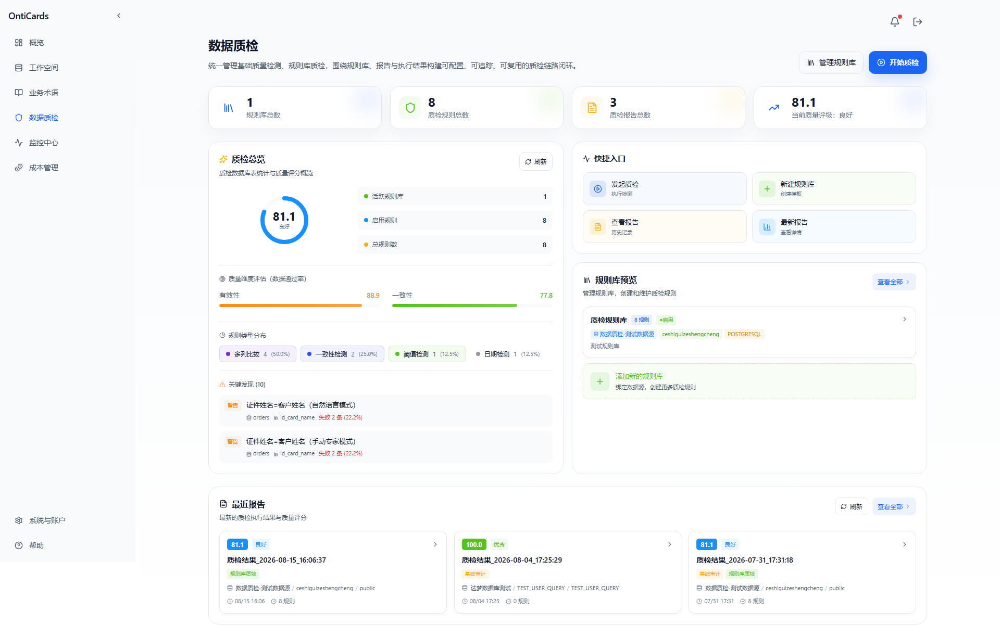

**顶部指标卡**：

- 规则库总数
- 启用的规则数
- 质检报告总数
- 当前质量评分

**质检总览**：

环形图展示「活跃规则」「启用规则」「总规则数」的占比，以及 **当前质量评分**（如 81.1 分）。

**质量维度评估**：

按维度展示得分，包括：

- 有效性（如 86.9）
- 一致性（如 77.8）

**规则类型分布**：多对象检查、一致性检查、唯一性检查、日期检查 等

**关键发现**：列出问题最严重的字段

**快捷入口**：

- 新建规则库
- 创建规则
- 查看报告
- 整库报告

**最近报告**：展示历史报告卡片，可点击查看详情。

**规则库管理页**（点击「规则库」Tab 进入）：

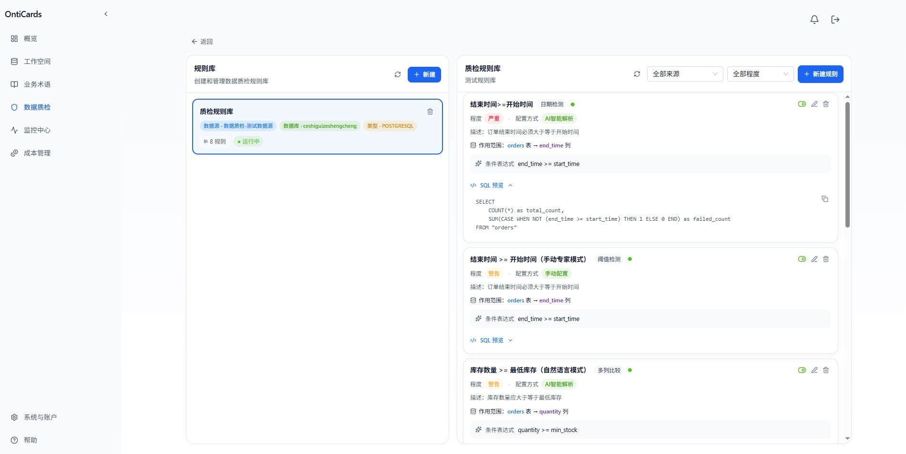

页面采用 **左右双栏布局**：

- **左侧「规则库」列表**：显示所有规则库（如「浙报-有道理-测试数据源」），含数据源/Schema 标识、规则数量与运行状态
- **右侧「质检规则库」详情**：
  - **顶部筛选**：按「全部数据源」「全部程度」过滤
  - **新增规则**按钮：唤起创建规则弹窗
  - **规则列表**（每行一条规则）：展示规则名、程度（严重/警告）、AI 解析、作用范围（schema.table + 列名）、条件表达式（自动转 SQL 预览）、启用/编辑/删除三件套操作

> 💡 同一条规则可被多个数据源复用。规则级别可设置为「严重（critical）」「警告（warning）」两种，决定问题严重程度与报告评分。

### 9.2 创建质检规则

**步骤 1：创建规则库**

1. 在「数据质检」首页点击「新建规则库」
2. 填写：
   - 规则库名称
   - 关联的数据源
3. 保存后即可在规则库内添加规则

**步骤 2：添加规则**

支持三种创建方式：

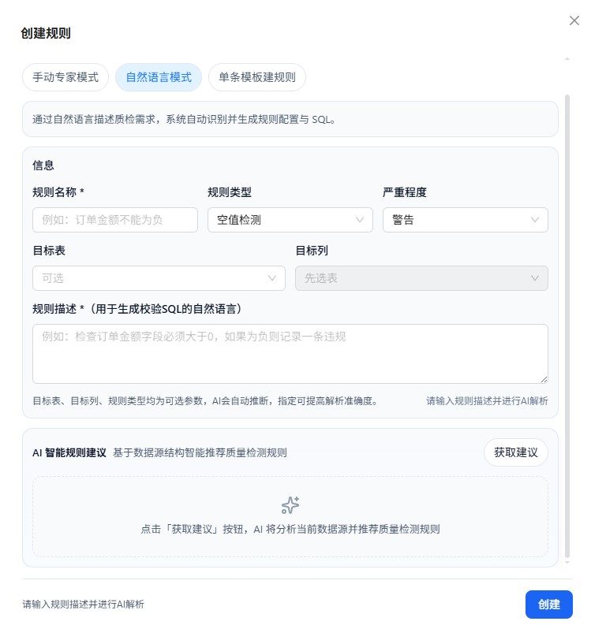

- **手动专家模式**：完全手工填写规则名、目标表/列、SQL 条件（适合复杂业务规则）
- **自然语言模式**：用一句话描述需求，AI 自动生成 SQL 与配置（推荐，门槛最低）
- **单条模板建规则**：从预设模板（空值检测/一致性/唯一性/范围 等）挑选并填入参数

**方式一：模板模式**

从预设模板中选择（最快捷）：

- 邮箱格式校验
- 手机号格式校验
- 身份证号校验
- 金额非空检查
- 日期范围检查
- ...

**方式二：AI 模式（推荐）**

用自然语言描述规则，系统自动生成配置：

- "检查订单表的金额是否大于 0"
- "检查用户表手机号是否为 11 位"
- "检查邮箱格式是否正确"

**方式三：手动模式**

直接配置规则参数：

| 规则类型  | 适用          |
| ----- | ----------- |
| 非空检查  | 必填字段不能为空    |
| 唯一性检查 | 主键/唯一索引字段   |
| 格式校验  | 邮箱、手机号、身份证  |
| 范围检查  | 数值/日期范围     |
| 枚举值检查 | 字段值必须在指定集合内 |
| 正则匹配  | 自定义正则       |
| 跨表比对  | 外键引用一致性     |

### 9.3 执行质检

1. 进入数据源 → 「数据质检」或顶层「数据质检」
2. 选择规则库或指定规则
3. 点击「开始执行」
4. 等待执行完成（根据数据量大小耗时不同）
5. 在执行结果页查看详细情况
6. 可下载质检报告物理文件

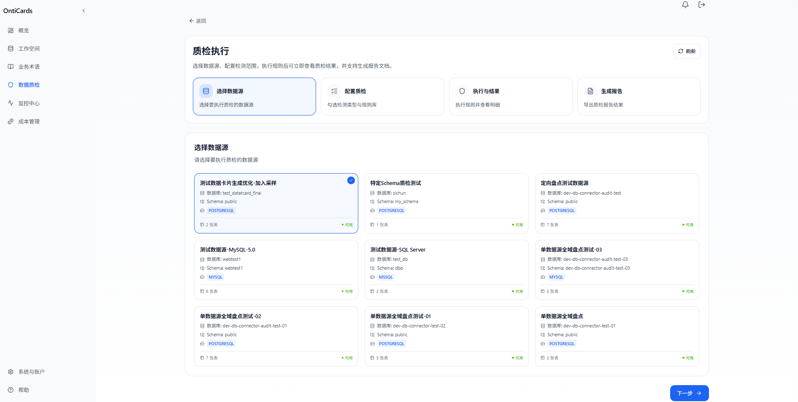

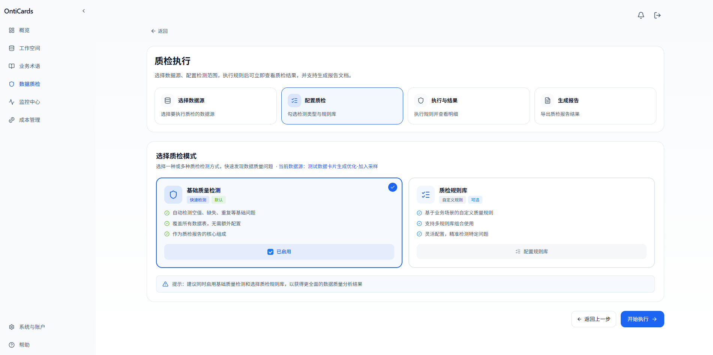

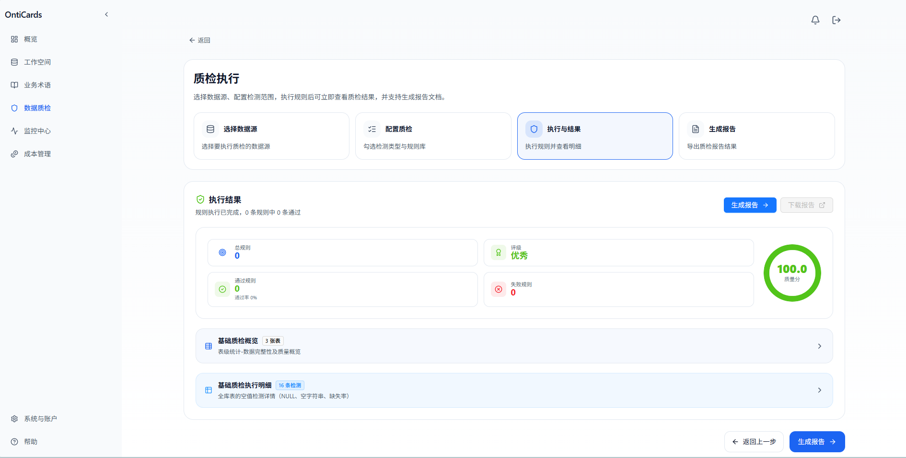

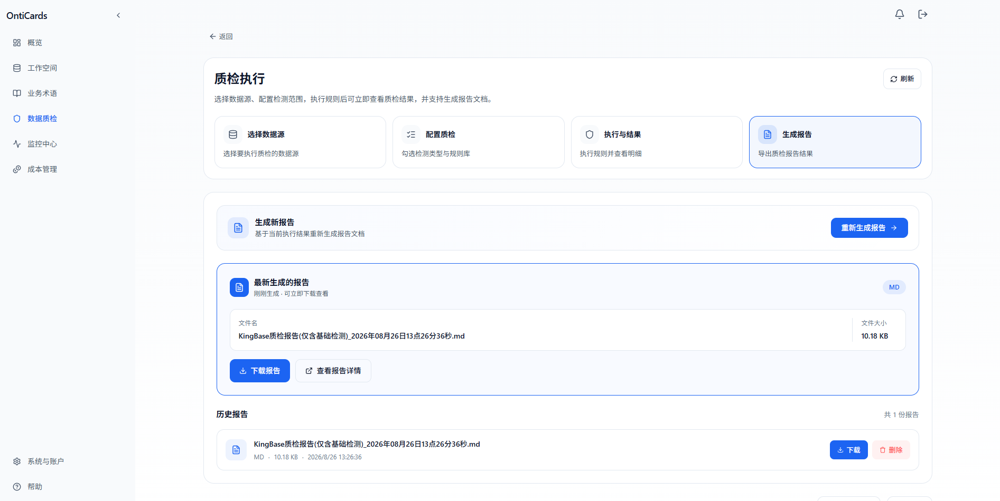

### 9.4 质量评分

| 等级 | 分数范围    | 说明      |
| -- | ------- | ------- |
| 优秀 | ≥ 95    | 数据质量非常好 |
| 良好 | 85 - 95 | 数据质量良好  |
| 一般 | 70 - 85 | 有改进空间   |
| 较差 | 60 - 70 | 问题较多    |
| 差  | < 60    | 严重问题    |

评分依据：通过率、平均问题数、问题严重程度加权计算。

### 9.5 质检报告

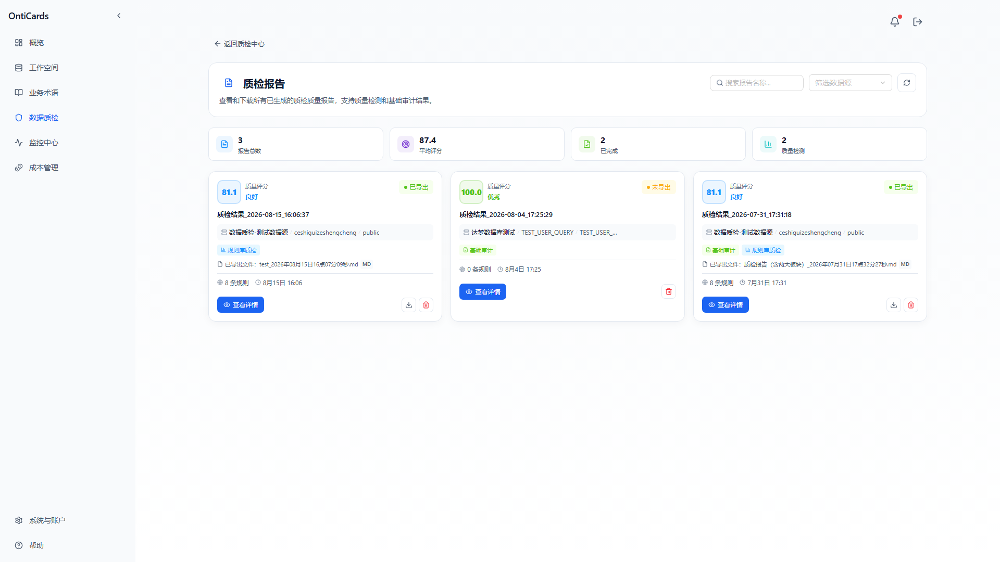

**报告列表页**展示所有历史报告卡片，每张卡片显示：

- 报告 ID
- 质检对象（数据源、Schema）
- 平均得分
- 已导出 / 未导出状态
- 已查/总表数
- 起始/截止时间
- 操作按钮：查看详情、下载、删除

**报告详情**包含：

- 各维度评分明细
- 每张表的健康分
- 每条规则的检查结果（通过/失败/异常数）
- 失败样本（前 N 条）

**单条报告详情页**：

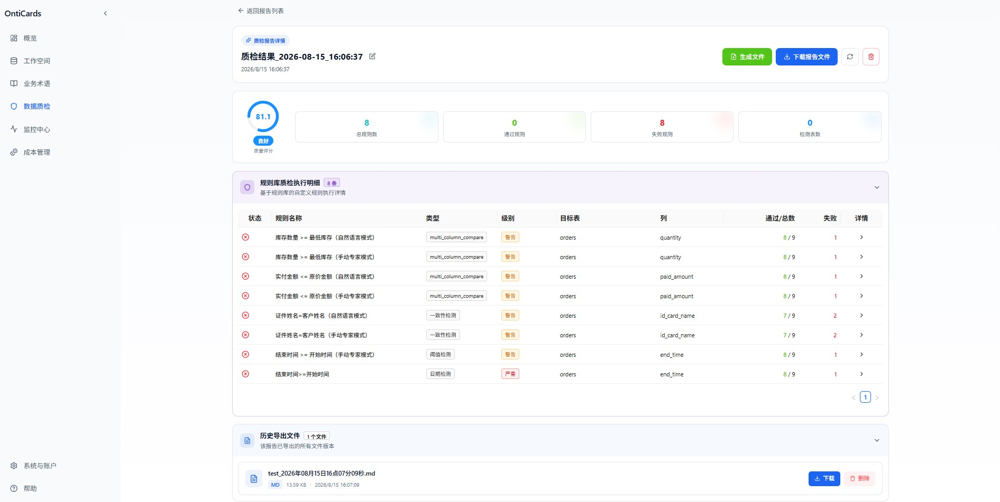

进入单条报告后可见：

- **报告头**：质检结果评分、生成时间，并提供「生成文件」「下载报告文件」「刷新」「删除」4 个全局操作
- **质量评分卡**（左上）：环形进度展示「良好（81.1）」等级，含总规则数（8）、通过数（0）、失败数（8）、检测表数（0）
- **规则库质检执行明细**：每条规则一行，字段含状态、规则名称、类型、级别（警告/严重）、目标表/列、通过/总数、失败数、详情入口
- **历史导出文件**：报告底部保留历史下载文件，可重新下载或删除

**规则执行明细**（点击「详情」展开）：

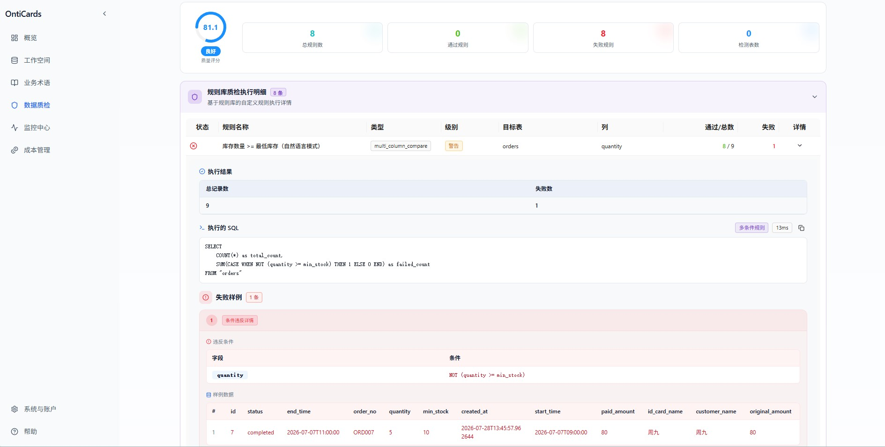

单条规则的执行详情展示 3 大区块：

| 区块          | 内容                                                                        |
| ----------- | ------------------------------------------------------------------------- |
| **执行结果**    | 总记录数、失败数（饼图化）                                                             |
| **执行的 SQL** | 可一键复制或重新生成，右侧显示耗时（如 `13ms`）                                               |
| **失败样例**    | 命中条件 + 字段（`quantity` 死否表达式 `quantity >= min_stock`）+ 样例数据（最多前 N 条，含完整字段值） |

**下载报告文件**（点击「下载报告文件」按钮生成）：

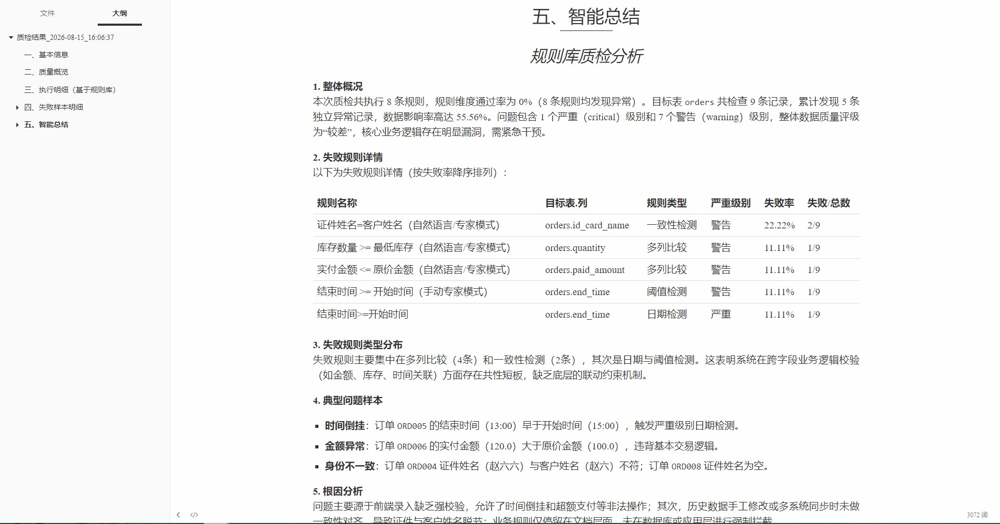

下载的报告为 Markdown 格式，按 **5 个章节** 组织：

1. **基本信息** — 报告 ID / 目标数据源 / 时间范围
2. **质量概览** — 整体评分、通过率、问题数
3. **执行明细（基于规则库）** — 各规则的失败情况
4. **失败样例明细** — 具体命中行
5. **智能总结** — AI 自动分析本次质检的 **失效规则详情**（按失效率排序）、**失效规则类型分布**、**典型问题样本**（如时间倒挂、金额异常、身份不一致等）、**根因分析**（如前端录入缺乏强校验、历史数据手工修改未做一致性检查等）

---

## 十、监控中心

监控中心是系统的可观测性仪表盘，提供**系统运行监控、数据分析和性能监控**的全方位能力，覆盖查询量、成功率、Token 消耗、耗时与数据源健康等关键指标。

### 10.1 监控总览

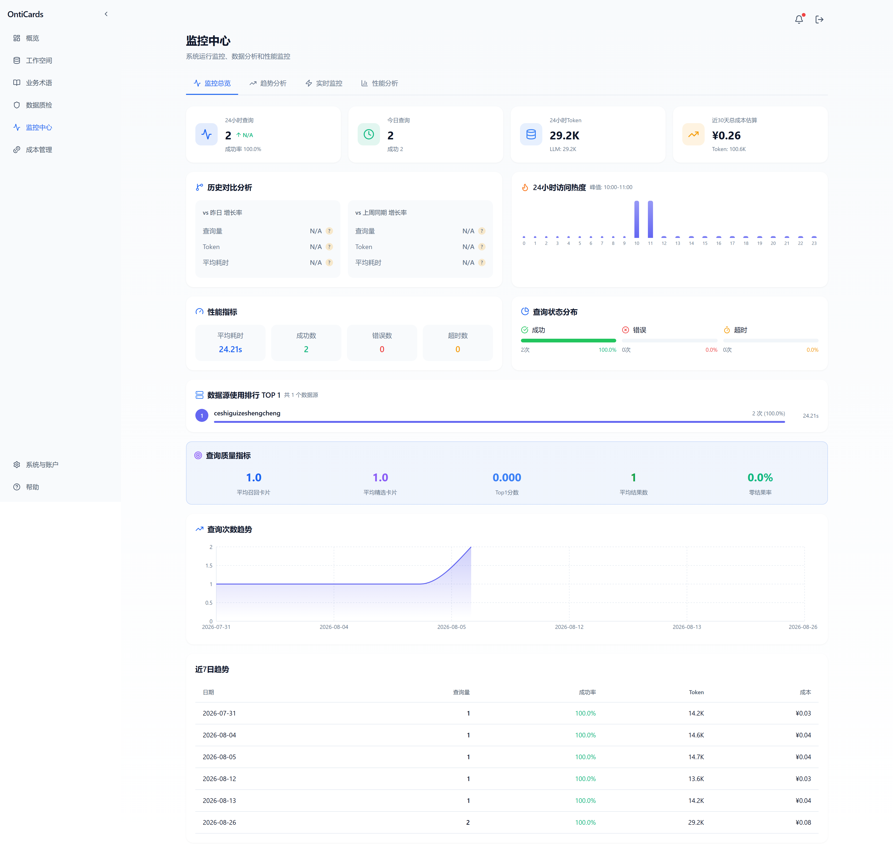

**顶部指标卡**（过去 24 小时）：

| 指标         | 说明              |
| ---------- | --------------- |
| 总查询量       | 当日累计查询次数及环比     |
| 今日查询       | 当日 0 点至今的查询数    |
| 24小时 Token | 24 小时内消耗的 Token |
| 近 30 天总成本  | 折算成金额（元）        |

**历史对比分析**：

- 今日 vs 昨日：查询量、Token、平均耗时
- 本周 vs 上周：查询量、Token、平均耗时

**24 小时访问热度**：

折线图展示 0-23 点的查询量分布。

**性能指标**：

- 平均耗时
- 成功数
- 错误数
- 超时数

**查询状态分布**：

成功 / 错误 / 超时 三色比例。

**查询质量指标**：

- 平均返回卡片数
- 平均候选卡片数
- Top10 分数
- 平均结果数
- 零结果率

**查询次数趋势**：每日查询量柱状图

**最近 7 天趋势表**：

| 日期         | 查询量 | 成功率  | Token | 成本    |
| ---------- | --- | ---- | ----- | ----- |
| 2026-08-13 | 1   | 100% | 14.2K | ¥0.04 |
| ...        | ... | ...  | ...   | ...   |

### 10.2 趋势分析

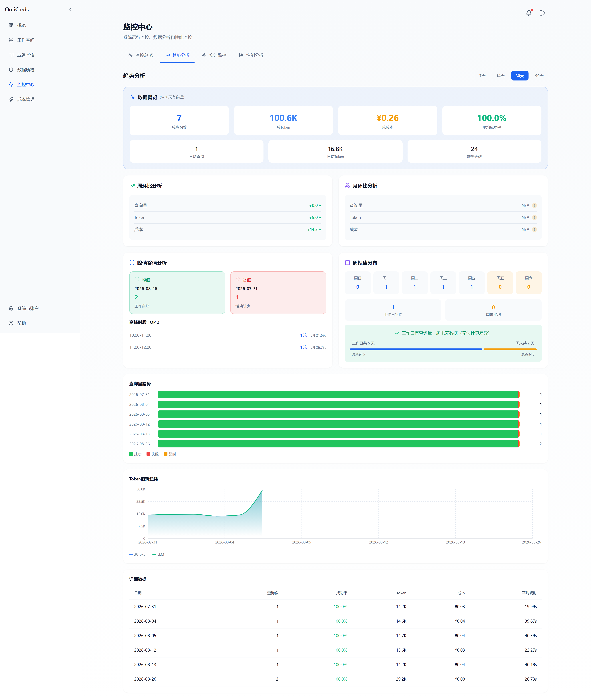

- 按时间范围（**7 天 / 14 天 / 30 天**）切换
- **顶部数据概览**（共 6 张卡）：总查询数、总 Token、总成本、平均成功率、日均查询、日均 Token、缺失天数
- **环比分析**：
  - **周环比**：查询量、Token、成本 vs 上周
  - **月环比**：查询量、Token、成本 vs 上月
- **峰值谷值分析**：自动识别本周期内查询量最高 / 最低日及对应工作日
- **周/周末分布**：周一~周日每日查询量与工作日平均/周末对比
- **高峰时段 TOP 2**：统计峰值查询所在的小时段（如 10:00-11:00 / 11:00-12:00）
- **查询量趋势**：堆叠柱状图（成功 / 失败 / 超时）
- **Token 消耗趋势**：双线图（Embedding / LLM）
- **详细数据表**：含日期、查询量、成功率、Token、成本、平均耗时，支持下载 CSV

### 10.3 实时监控

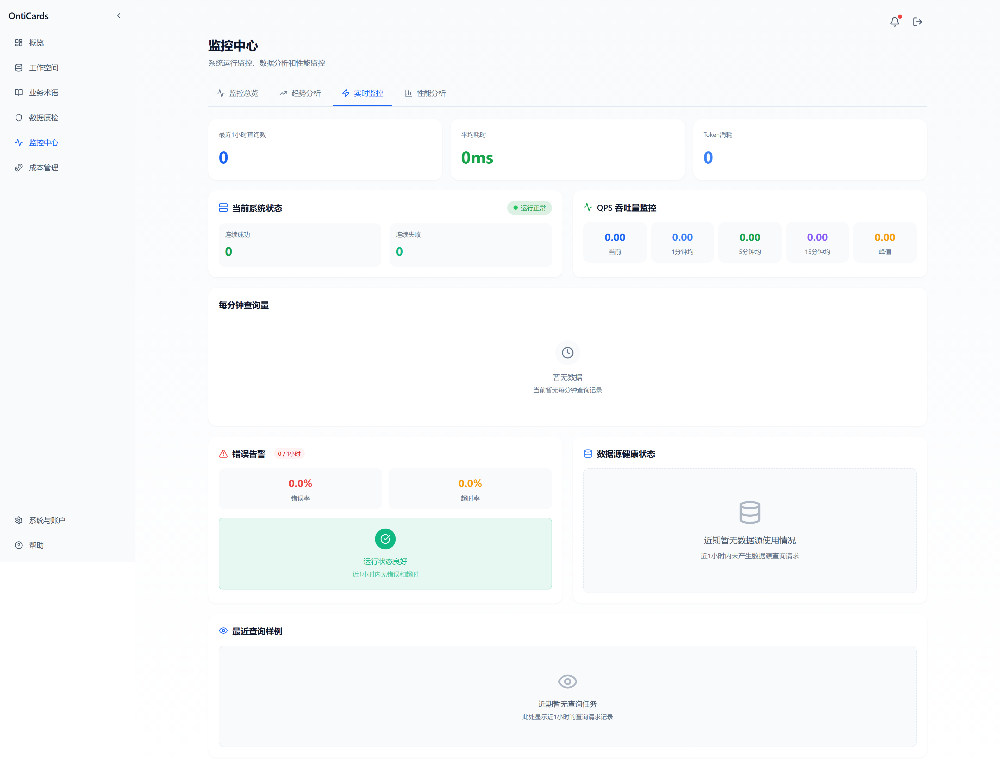

- **顶部 3 卡**（最近 1 小时）：查询数 / 平均耗时 / Token 消耗
- **当前系统状态**：连接成功数 / 连接失败数 / 正常运行徽标
- **QPS 吞吐量监控**：当前 / 1 分钟均 / 5 分钟均 / 15 分钟均 / 峰值
- **每分钟查询量**：折线图实时滚动展示（暂无数据时显示「暂无数据」占位）
- **错误告警**：错误率、超时率（均为 0 时显示绿色「运行状态良好」提示）
- **数据源健康状态**：标记近期无数据源使用情况，建议查询以生成数据源查询请求
- **最近查询样例**：滚动展示最近 1 小时内的查询任务
- 自动刷新

### 10.4 性能分析

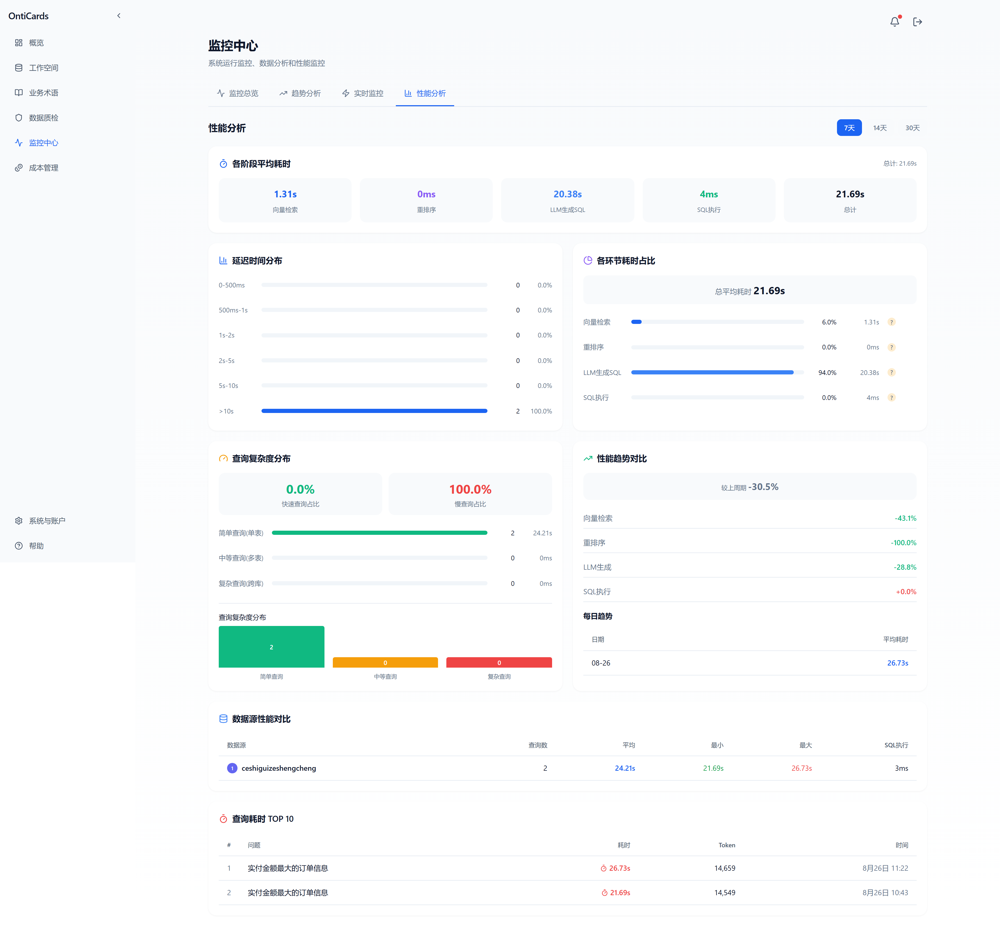

- 按时间范围（**7 天 / 14 天 / 30 天**）切换
- **各阶段平均耗时卡**（5 卡）：向量检索、重排序、LLM 生成 SQL、SQL 执行、总计
- **延迟时间分布**：0-500ms / 500ms-1s / 1s-2s / 2s-5s / 5s-10s / >10s 共 6 档
- **各环节耗时占比**：水平条形图展示各阶段耗时占比 + 较上周期涨跌
- **查询复杂度分布**：简单查询（单表）/ 中等查询（多表）/ 复杂查询（跨库）占比
- **性能趋势对比**：总平均耗时 vs 上周期 + 各阶段环比（向量检索 -43.1% 等）
- **每日趋势**：按日展示平均耗时
- **数据源性能对比**：每行的查询数、平均耗时、最小/最大耗时、SQL 执行
- **查询耗时 TOP 10**：列出 Top 10 慢查询（含问题、耗时、Token、时间）

---

## 十一、成本管理

「成本管理」模块提供 **Token 价格规则配置**与**成本统计**能力，帮助实时跟踪查询成本消耗、控制预算并优化模型使用策略。

### 11.1 Token 价格配置

支持为不同模型组件配置单价：

| 配置项          | 默认值                | 说明       |
| ------------ | ------------------ | -------- |
| Embedding 价格 | 0.0005 元 / 千 Token | 向量检索成本   |
| Rerank 价格    | 0.0008 元 / 千 Token | 重排序成本    |
| LLM 输入价格     | 0.0024 元 / 千 Token | SQL 生成输入 |
| LLM 输出价格     | 0.0096 元 / 千 Token | SQL 生成输出 |

> 💡 实际单价以你采购的 LLM 服务为准，可在「系统与账户 → 模型配置」调整模型与对应单价。

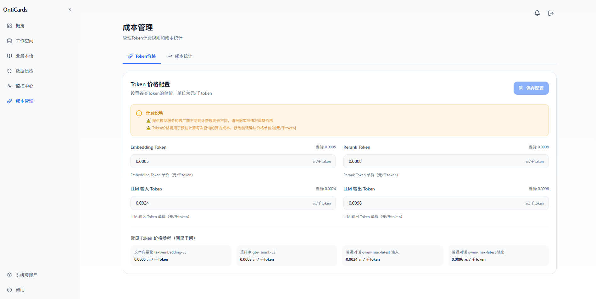

### 11.2 成本统计

**顶部指标卡**：

- 近 30 天总成本
- 30 天总 Token
- 今日总成本
- 24 小时成本

**环比变化**：查询量、Token、响应时间

**查询状态分布**

**24 小时 Token 消耗分布**：

按组件分类（Embedding / Rerank / LLM）

**每日成本趋势**（近 7 天）：

横向条形图展示每日成本，右侧显示占比与金额。

**24 小时查询分布**：

24 小时查询量分布柱状图（按 30 分钟粒度）

**数据源使用统计**：

每个数据源消耗的 Token 与成本占比。

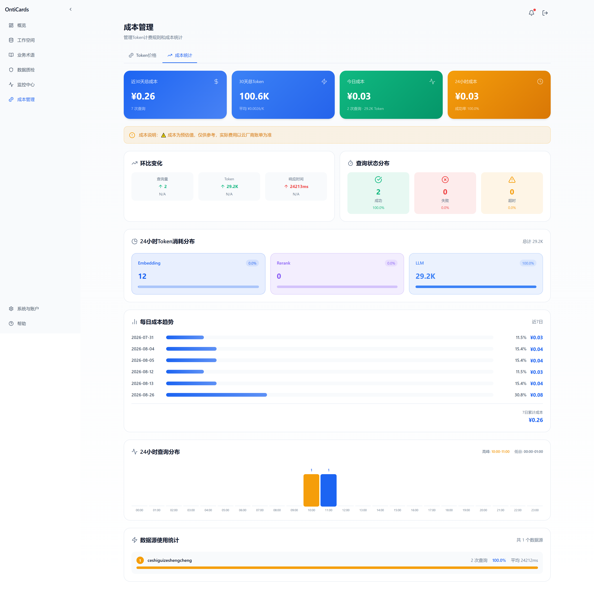

> ⚠️ **成本说明**：成本为预估值，仅供参考。实际费用以云厂商账单为准。

---

## 十二、系统与账户

进入「系统与账户」/「设置」：

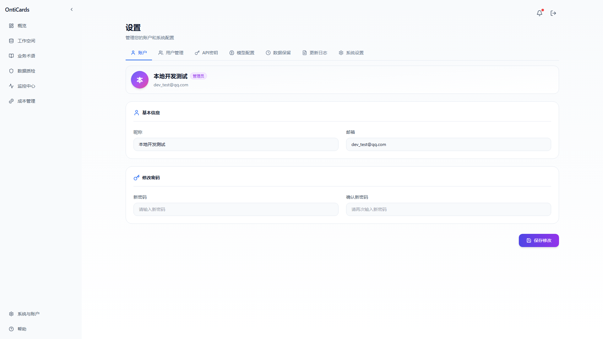

设置中心包含 7 个子模块：

| Tab    | 用途                     |
| ------ | ---------------------- |
| 账户     | 个人基本信息、修改密码            |
| 用户管理   | 管理系统用户（仅管理员可见）         |
| API 密钥 | 管理第三方调用的 API Key       |
| 模型配置   | 配置 AI 模型（基础对话、向量化、重排序） |
| 数据保密   | 敏感字段脱敏配置               |
| 鉴权日志   | 登录与操作审计日志              |
| 系统设置   | 系统级配置                  |

### 12.1 账户信息


- 头像、昵称
- 邮箱（用于找回密码）
- 修改密码
- 「保存修改」提交

### 12.2 用户管理

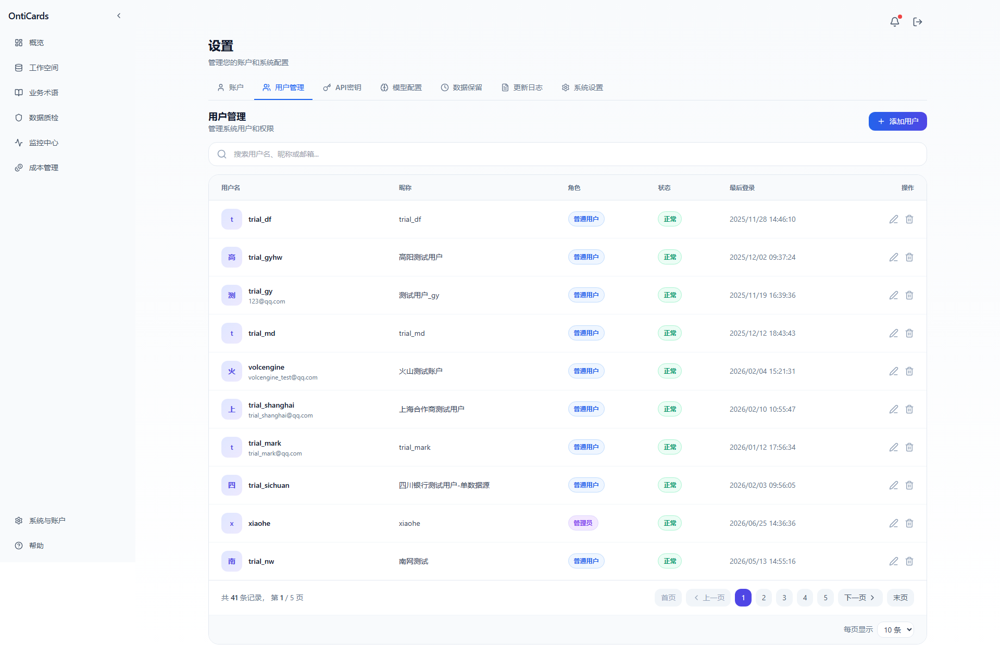

仅管理员可见。提供：

- 用户列表：用户名、昵称、角色、状态、最后登录时间
- 搜索：按用户名、昵称、邮箱
- 添加用户：右上角「添加用户」按钮
- 编辑用户：每行末尾的「编辑」图标
- 删除用户：每行末尾的「删除」图标
- 分页：共 N 条记录，可翻页

角色包括：

- **管理员**：拥有所有权限
- **普通用户**：受限的功能访问

### 12.3 API 密钥

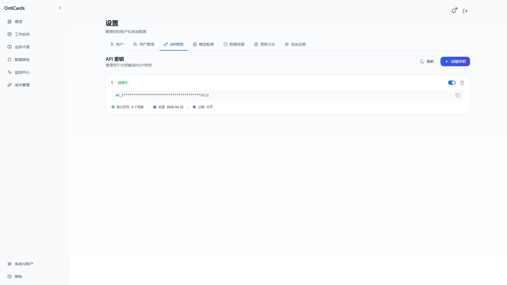

用于第三方系统集成。提供：

- API 密钥列表
- 状态显示（启用 / 停用）
- 「创建密钥」生成新的 API Key
- 复制密钥值
- 启用/停用、删除密钥

**使用方式**：

```bash
curl -X POST https://your-host/api/v1/query \
  -H "Authorization: Bearer ak_xxxxxxxxxxxxx" \
  -H "Content-Type: application/json" \
  -d '{
    "question": "查询最近 7 天的订单量",
    "data_source_id": 1
  }'
```

> 🔐 **安全提示**：请妥善保管 API 密钥，定期轮换。如发现泄露，立即停用并重新创建。

详细接口文档：[API 接口文档](./API接口文档.md)

### 12.4 模型配置

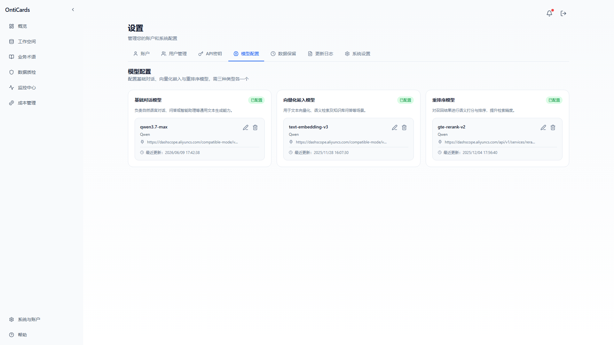

OntiCards 依赖 3 类 AI 模型：

| 模型类型   | 作用              | 配置字段                |
| ------ | --------------- | ------------------- |
| 基础对话模型 | 负责自然语言理解、SQL 生成 | 名称、API 兼容地址、API Key |
| 向量化模型  | 把文本转为向量用于检索     | 名称、API 兼容地址、API Key |
| 重排序模型  | 优化检索结果排序        | 名称、API 兼容地址、API Key |

**配置步骤**：

1. 选择模型类型卡片
2. 填写：
   - 名称（如 `qwen3.7-max`）
   - 兼容 OpenAI 的 API 地址（如 `https://dashscope.aliyuncs.com/compatible-mode/v1`）
   - API Key
3. 测试连接
4. 启用

> ✅ 系统支持 **任意 OpenAI 兼容接口**，可对接阿里云通义、DeepSeek、OpenAI、Azure OpenAI、Anthropic 等。

### 12.5 数据保密

用于配置 **敏感字段脱敏**：

- 选择数据源
- 选择需要脱敏的字段
- 选择脱敏策略（部分掩码、哈希、置空）
- 应用到问数结果展示

脱敏后的字段：

- 在查询结果中按规则展示
- 在导出文件中按规则展示
- 不影响原始数据库

### 12.6 鉴权日志

记录所有用户操作：

- 登录 / 登出
- 数据源新增 / 修改 / 删除
- 规则新增 / 执行
- API 调用
- 敏感操作

每条记录包含：用户、时间、IP、操作类型、对象、结果。

### 12.7 系统设置

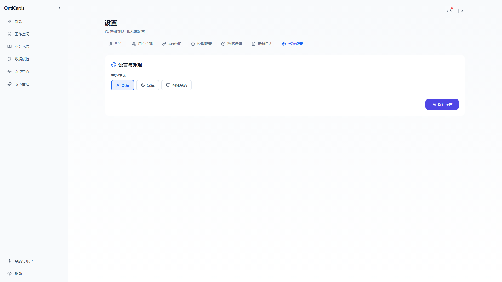

系统级配置：

- 默认主题（浅色 / 深色）

---

## 十三、数据安全

OntiCards 在多个层面保障数据安全：

### 13.1 访问隔离

- 用户与数据源是 **多对一** 关系
- 每位用户只能访问自己添加的数据源
- 不同用户之间的数据源互相不可见
- 工作空间与术语库按用户隔离

### 13.2 只读保护

- 系统 **只执行 SELECT**（查询）操作
- **不提供** 任何 INSERT / UPDATE / DELETE / DROP / ALTER 的入口
- 所有生成的 SQL 都经过安全校验
- 危险关键词（如 `DROP`、`TRUNCATE`）被强制过滤

### 13.3 密码保护

- 数据库密码使用加密算法（AES-256）存储
- 密码 **不会** 出现在界面、查询结果、日志中
- 密码在传输过程中通过 HTTPS 加密
- 切换数据源时密码自动遮罩显示

### 13.4 操作审计

- 所有用户的关键操作被记录
- 包含：时间、用户、IP、操作类型、对象、结果
- 审计日志不可篡改（只追加）
- 支持导出与第三方 SIEM 对接

### 13.5 敏感脱敏

- 字段级脱敏策略
- 问数结果按策略脱敏
- API 返回结果按策略脱敏
- 不影响原始数据存储

### 13.6 SSO 与 MFA

- 支持 JWT Token 模式 SSO
- 可对接企业级身份系统（LDAP、AD、OAuth2.0、OIDC、CAS）
- 可启用多因素认证（MFA）

> 🔐 JWT 模式 SSO 的完整对接流程见 [第十五章 SSO 单点登录对接（JWT 模式）](#十五sso-单点登录对接jwt-模式)。

---

## 十四、API 与第三方集成

OntiCards 通过 REST API 暴露核心能力，支持与以下系统集成：

- **AI 智能体 / Agent**：把"自然语言问数"能力嵌入到 AI Agent
- **RPA / 自动化平台**：定时自动问数并推送结果
- **BI 平台**：作为 BI 的「智能问数」增强层
- **企业微信 / 钉钉 / 飞书机器人**：让用户在 IM 中直接问数据
- **自研业务系统**：把"问数据"能力嵌入到业务后台

### 14.1 鉴权方式

使用 **API Key** 进行鉴权：

```http
Authorization: Bearer ak_xxxxxxxxxxxxxxxx
```

### 14.2 核心接口

| 接口                    | 方法   | 用途       |
| --------------------- | ---- | -------- |
| `/api/v1/query`       | POST | 提交自然语言问题 |
| `/api/v1/query/{id}`  | GET  | 查询执行结果   |
| `/api/v1/datasources` | GET  | 列出数据源    |
| `/api/v1/terms`       | GET  | 列出业务术语   |
| `/api/v1/health`      | GET  | 健康检查     |

**示例：自然语言问数**

```bash
curl -X POST https://your-host/api/v1/query \
  -H "Authorization: Bearer ak_xxxxxxxx" \
  -H "Content-Type: application/json" \
  -d '{
    "question": "查询最近 30 天的订单量",
    "data_source_id": 1
  }'
```

**响应**：

```json
{
  "query_id": "q_abc123",
  "status": "success",
  "sql": "SELECT DATE(created_at) AS day, COUNT(*) FROM orders WHERE created_at >= NOW() - INTERVAL 30 DAY GROUP BY day",
  "data": [
    {"day": "2026-07-27", "count": 1234},
    {"day": "2026-07-28", "count": 1456}
  ],
  "duration_ms": 412,
  "tokens": 1432
}
```

详细 API 文档：[API 接口文档](./API接口文档.md)

### 14.3 Webhook

支持配置 Webhook，在以下事件触发时推送通知：

- 查询完成
- 质检报告生成
- 数据源异常

---

## 十五、SSO 单点登录对接（JWT 模式）

当企业已有自己的用户体系（门户、OA、业务系统）时，可通过 **JWT 模式 SSO 单点登录** 与 OntiCards 打通用户体系：用户在己方系统完成登录后，无需二次输入账号密码，即可直接跳转进入 OntiCards。

> 🔐 本章面向负责对接的**开发人员**。SSO 配置完成后，终端用户的登录体验与普通登录一致。

### 15.1 什么是 JWT Token

JWT（JSON Web Token）是一种开放标准（RFC 7519），用于在各方之间安全地传输信息。JWT 由三部分组成，用点号分隔：

```
eyJhbGciOiJIUzI1NiIsInR5cCI6IkpXVCJ9.eyJ1c2VybmFtZSI6InpoYW5nX3NhbiIsInVzZXJfaWQiOiJTWVNfVVNFUl8wMDEifQ.signature
|______________|.|__________________________________________|.______________|
    Header      |              Payload                      |   Signature
     头部        |              用户数据                      |     签名
```

| 部分   | 名称              | 作用                    | 示例内容                                        |
| ----- | --------------- | --------------------- | -------------------------------------------- |
| 第一部分 | Header（头部）    | 声明算法和类型              | `{"alg":"HS256","typ":"JWT"}`                |
| 第二部分 | Payload（负载）   | 存放实际的用户数据            | `{"username":"zhang_san","user_id":"001",...}` |
| 第三部分 | Signature（签名） | 用密钥对前两部分签名，确保不被篡改    | `SflKxwRJSMeKKF2QT4fwpMeJf36POk6yJV_adQssw5c` |

### 15.2 整体流程

```
1. 客户后端生成 JWT Token
   ↓
2. 拼接 SSO 登录 URL（带上 token 和 redirect_url）
   ↓
3. 用户浏览器跳转到 OntiCards 的 SSO 接口
   ↓
4. OntiCards 验证 JWT、创建/关联用户、生成自己的 Token
   ↓
5. 浏览器跳转到 redirect_url，带上 OntiCards 的 Token
   ↓
6. 客户前端接收 Token，登录完成
```

> 💡 **用户自动关联**：首次通过 SSO 访问时，OntiCards 会根据 `user_id` + `source` 查找已存在用户；新用户自动创建，老用户直接关联登录，无需人工开通账号。

### 15.3 配置清单

对接前需要准备以下配置：

| 配置项                  | 说明                       | 示例值                                        |
| -------------------- | ------------------------ | ------------------------------------------ |
| **SSO 共享密钥**         | 用于 JWT 签名，两端必须一致          | `K7x#9mP$2nL5@qR8`（建议 64 位以上随机字符串）         |
| **OntiCards API 地址** | OntiCards 的 SSO 登录接口地址    | `https://api.onticards.com`                |
| **回调跳转地址**           | 登录成功后跳转的前端页面             | `https://frontend.onticards.com/overview`  |

**服务端配置**：在 OntiCards 服务端 `.env` 中配置共享密钥（详见[部署指南](./部署指南.md)）：

```env
SSO_SECRET_KEY=客户提供的共享密钥
```

### 15.4 Token 生成详解

Token 生成**必须由客户后端完成**（共享密钥不能暴露在前端）。

**① Header（头部）**：固定格式，声明使用 HS256 算法，然后进行 Base64URL 编码：

```json
{
    "alg": "HS256",
    "typ": "JWT"
}
```

**② Payload（负载/用户数据）**：包含要传递的用户信息：

| 字段         | 类型     | 必填  | 说明                              |
| ---------- | ------ | --- | ------------------------------- |
| `username` | string | ✅   | 用户的唯一标识，不能为空                    |
| `user_id`  | string | ✅   | 客户系统中的用户 ID，不能为空                |
| `nickname` | string | ❌   | 用户昵称                            |
| `email`    | string | ❌   | 用户邮箱                            |
| `source`   | string | ❌   | 来源标识，用于区分不同系统，默认 `default`      |
| `iat`      | number | ❌   | Token 签发时间（Unix 时间戳）            |
| `exp`      | number | ✅   | Token 过期时间（Unix 时间戳），建议设置为 5 分钟后 |

**③ Signature（签名）**：将前两部分用点号连接后，用共享密钥签名：

```
签名字符串 = Header_base64 + "." + Payload_base64
签名 = HMAC-SHA256(签名字符串, 共享密钥)
```

**最终的 JWT Token**：

```
JWT Token = Header_base64 + "." + Payload_base64 + "." + Signature_base64
```

### 15.5 各语言示例

**Python**：

```python
import jwt
from datetime import datetime, timedelta, timezone

SECRET_KEY = "your_shared_secret_key"  # 与 OntiCards 服务端共享的密钥

payload = {
    "username": "zhang_san",
    "user_id": "SYS_USER_001",
    "nickname": "张三",
    "email": "zhangsan@example.com",
    "source": "your_app",
    "iat": datetime.now(timezone.utc),
    "exp": datetime.now(timezone.utc) + timedelta(minutes=5)  # 5 分钟后过期
}

token = jwt.encode(payload, SECRET_KEY, algorithm="HS256")
print(token)
```

**Java**（jjwt 0.12+）：

```java
String token = Jwts.builder()
    .claims(Map.of(
        "username", "zhang_san",
        "user_id", "SYS_USER_001",
        "nickname", "张三",
        "email", "zhangsan@example.com",
        "source", "your_app"))
    .issuedAt(new Date())
    .expiration(new Date(System.currentTimeMillis() + 5 * 60 * 1000))
    .signWith(Keys.hmacShaKeyFor(secretKey.getBytes(StandardCharsets.UTF_8)))
    .compact();
```

**Node.js**：

```javascript
const jwt = require('jsonwebtoken');

const token = jwt.sign({
    username: 'zhang_san',
    user_id: 'SYS_USER_001',
    nickname: '张三',
    email: 'zhangsan@example.com',
    source: 'your_app'
}, 'your_shared_secret_key', {
    algorithm: 'HS256',
    expiresIn: '5m'  // 5 分钟后过期
});
```

> ⚠️ 生产环境 Token 生成**必须在后端完成**，共享密钥绝不能出现在前端代码中。

### 15.6 拼接登录 URL 并跳转

**构造 URL**：

```
{OntiCards API地址}/sso/login?token={JWT Token}&redirect_url={回调地址}
```

**示例**：

```
https://api.onticards.com/sso/login?token=eyJhbGciOiJIUzI1NiIsInR5cCI6IkpXVCJ9...&redirect_url=https://frontend.onticards.com/overview
```

**跳转代码**（生成 Token 后执行跳转，推荐直接跳转）：

```javascript
const ssoUrl = `${API_BASE}/sso/login?token=${encodeURIComponent(token)}&redirect_url=${encodeURIComponent(FRONTEND_URL)}`;
window.location.href = ssoUrl;
```

### 15.7 回调接收 Token

登录成功后，浏览器会跳转到：

```
https://frontend.onticards.com/overview?access_token=eyJhbGciOiJIUzI1NiIsInR5cCI6IkpXVCJ9...
```

**前端接收 Token 的代码**：

```javascript
// 从 URL 获取 access_token 参数
function getAccessToken() {
    return new URLSearchParams(window.location.search).get('access_token');
}

const token = getAccessToken();
if (token) {
    localStorage.setItem('access_token', token);
    // 清理 URL 中的 token 参数（防止 token 泄露）
    window.history.replaceState({}, document.title, window.location.pathname);
}

// 后续 API 请求时在 Header 中携带 Token
fetch('/api/your-endpoint', {
    headers: { 'Authorization': 'Bearer ' + localStorage.getItem('access_token') }
});
```

### 15.8 错误码说明

| HTTP 状态码 | error 字段            | 原因                            |
| -------- | ------------------ | ----------------------------- |
| 400      | `缺少token参数`        | URL 中没有传 token                |
| 400      | `token中缺少必要的用户信息`  | Payload 中 username 或 user_id 为空 |
| 401      | `token已过期`         | Token 的 exp 已过期               |
| 401      | `token无效`          | 签名验证失败（密钥不匹配或内容被篡改）          |

### 15.9 测试验证

**本地测试页面**：

- **SSO 测试中心**：`http://localhost:9000/static/sso_test.html`
- **回调测试页面**：`http://localhost:9000/static/sso_callback.html`

**对接检查清单**：

- [ ] 生成 JWT Token（验证三部分结构：Header.Payload.Signature）
- [ ] Payload 中包含必填字段：username、user_id、exp
- [ ] Token 使用 HS256 算法签名
- [ ] 拼接 SSO 登录 URL 并测试跳转流程
- [ ] 验证回调页面能接收 access_token
- [ ] 确认 Token 有效期（建议 5 分钟）
- [ ] 生产环境使用强密钥，不要使用示例密钥

---

## 十六、常见问题（FAQ）

### Q1：登录后看不到数据源？

**原因**：

- 你是新用户，还没有添加过数据源
- 或管理员还未授权

**解决**：

- 在「工作空间」点击「添加新数据源」
- 或联系管理员授权

### Q2：数据卡片生成很慢？

**原因**：

- 数据源表数量大
- 字段数多
- LLM 响应慢

**建议**：

- 等待系统异步完成（可在「任务」Tab 查看进度）
- 调整 LLM 基础对话模型为更快的模型
- 大表可分批刷新

### Q3：问数结果不准？

按以下顺序排查：

1. **数据卡片质量**：表与字段的描述是否准确
2. **业务术语库**：是否定义了你问题中的业务概念
3. **数据盘点**：表之间的关系是否已盘点
4. **提问方式**：是否表达得足够具体
5. **查看「查询说明」**：系统如何理解你的问题

### Q4：部分条件被忽略？

系统在解析时无法在当前数据库中识别某些条件。会：

- 执行能识别的条件
- 在结果中明确标注「被忽略的条件」及原因
- 提示你如何补充（如增加数据卡片）

### Q5：查询速度慢？

**建议**：

- 增加时间范围限制
- 加上必要的筛选条件
- 避免一次性查询过多数据
- 联系 DBA 优化相关表索引

### Q6：Token 消耗大？

**建议**：

- 简化问题描述
- 减少不必要的历史对话
- 切换到更小更快的模型
- 在「系统与账户 → 模型配置」中调整

### Q7：API Key 泄露了怎么办？

**立即处理**：

1. 在「API 密钥」中**停用**该密钥
2. 创建新密钥
3. 更新所有使用方
4. 检查「鉴权日志」看是否有异常调用

### Q8：想增加新数据库类型？

- 开源版支持的数据库见 [§3.3](#33-支持的数据库类型)
- 商业版可定制更多数据库
- 提交 [Feature Request](https://github.com/your-org/onticards/issues)

---

## 十七、获取帮助

### 文档

| 文档       | 链接                             |
| -------- | ------------------------------ |
| 快速开始     | [快速开始.md](./快速开始.md)           |
| 部署指南     | [部署指南.md](./部署指南.md)           |
| API 接口文档 | [API接口文档.md](./API接口文档.md)     |
| FAQ      | [FAQ.md](./FAQ.md)             |
| 问题排查     | [问题排查指南.md](./问题排查指南.md)       |
| 更新日志     | [CHANGELOG.md](./CHANGELOG.md) |

### 在线资源

- **GitHub Issues**：提交 Bug 或功能请求
- **产品官网**：<https://onticards.example.com>
- **技术博客**：<https://onticards.example.com/blog>
- **社区论坛**：扫码加入用户交流群

### 商业支持

需要企业级支持、定制开发、私有化部署、行列级权限、SSO 增强等高级能力，请联系商业团队。

---

> 🎯 **下一步**：[快速开始](./快速开始.md) · [API 接口文档](./API接口文档.md) · [问题排查指南](./问题排查指南.md)

*本文档最后更新时间：2026 年 8 月*
