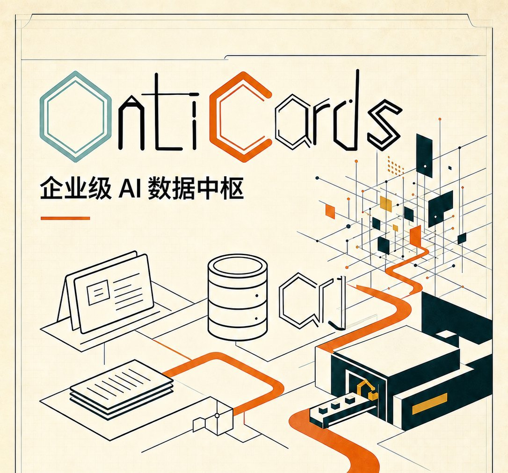

🌐 Languages:
[简体中文](README.md) | [繁體中文(香港)](README_zh-HK.md) | **English**

# OntiCards



> **Enterprise AI Data Hub** — Making enterprise data *talk, listen, and stay governed*.

[](https://github.com/stepll2026/OntiCards/releases)
[](./LICENSE)
[](https://www.step2.com.cn/docs/zh-cn/)
[](https://www.step2.com.cn/docs/zh-cn/deployment.html)

## Do These Sound Familiar?

- A business colleague asks for one number. It goes into a ticket queue, waits for the data team to write SQL — and a week later, the report still hasn't arrived.
- Hundreds of tables sit in your systems, and nobody can say what each one is for or what its columns mean. To ask a question about data, you first have to find "the person who created that table."
- Data is scattered across MySQL, Oracle, and various business systems. Cross-database analysis means exporting spreadsheets and stitching them together by hand — and the numbers from two departments still don't match.
- Data quality is a matter of luck. Nobody notices a broken report until the boss points it out in a meeting.
- You have no idea who queried what data and when. Sensitive information is essentially exposed, and when auditors show up, there are no records to produce.

All of these problems share the same root cause: **data capability is locked in the hands of the few who can write SQL, while the data itself is undocumented, hard to find, hard to trust, and impossible to govern.**

## What Is OntiCards

OntiCards is an open-source, enterprise-grade AI Data Hub. It connects to your existing business databases and turns data from "something only SQL writers can use" into **an asset that anyone who understands the business can query, quality-check, manage, and audit directly**:

- **No SQL required**: Ask questions in everyday business language. The system handles multi-step reasoning, database dialect adaptation, and SQL safety checks, so business users can self-serve their data.
- **Every table gets a manual**: AI automatically generates a Smart Data Card for each table — column profiling, three-tier sensitive field detection, business terminology, and table relationship mapping. For the first time, your data can explain itself.
- **One question, many databases**: Query across multiple databases at once, with results automatically aligned and merged. No more spreadsheet stitching.
- **Someone is always watching data quality**: 14 types of quality-check rules, natural-language rule creation with AI, quality scoring, and report export — when something breaks, you read a report instead of getting blamed.
- **Enterprise-grade security and audit**: Data source isolation, sensitive data masking, full query audit trails, API-Key integration, and JWT-based SSO. Self-hosted deployment keeps your data inside your own network.

> 📌 The open-source edition is completely free and self-hosted. Enterprise capabilities such as multi-tenancy and row/column-level permissions are offered as commercial services — see [Commercial Services](#commercial-services) below.

## Key Capabilities

- **Multi-source data connectivity**: MySQL, PostgreSQL, Oracle, SQL Server, SQLite, Trino, plus Chinese domestic databases (DMDB, KingBase, OceanBase) — 9 data source types in total.
- **Intelligent data understanding**: Auto-generated Smart Data Cards per table, including column profiles, sensitive field detection, a business glossary, and AI-driven table relationship mapping.
- **Natural language querying**: NL2SQL with multi-step reasoning, multi-dialect adaptation, automatic business-term expansion, and SQL safety validation.
- **Cross-source federated queries**: Ask once, query across databases, with automatic result alignment and merging.
- **Data quality checks**: 14 rule types, AI-assisted rule creation in natural language, quality scoring, and exportable reports.
- **Enterprise platform features**: Data source isolation, sensitive data masking, query auditing, API-Key integration, JWT-SSO, query monitoring, and cost statistics.

## Quick Start

### Requirements

| Item | Requirement |
| --- | --- |
| OS | Linux x86_64 (Ubuntu 22.04/24.04 recommended) |
| Docker | Docker Engine + Docker Compose plugin **v2.24.0+** |
| Minimum specs | 2 vCPU / 4 GB RAM |
| Browser | Modern desktop browser (Chrome / Edge) |

### Three Steps to Launch

```bash
# 1. 克隆仓库
git clone https://github.com/stepll2026/OntiCards.git
cd OntiCards

# 2. 配置环境变量（.env.example 提供可直接启动的开发默认值）
cp .env.example .env
chmod 600 .env
#    生产环境请至少修改：DB_PASSWORD、SECRET_KEY、SSO_SECRET_KEY、
#    CONNECT_INFO_MASTER_KEY、PUBLIC_BASE_URL、ALLOWED_ORIGINS

# 3. 校验配置并一键启动（首次会构建 API 与 Web 镜像）
docker compose config -q
docker compose up -d --build

# 访问（Nginx :9107 为唯一对外入口，数据库/向量库/API/Web 均在内网）
open http://your-ip:9107
```

> 📖 For the full deployment guide (registry mirrors, offline deployment, port changes, upgrades), see the official docs: [Deployment Guide](https://www.step2.com.cn/docs/zh-cn/deployment.html)

### 5-Minute Walkthrough

1. Log in and configure an LLM (Qwen, DeepSeek, Zhipu AI, GPT, Claude, and more are supported).
2. Add a business data source.
3. Wait for the **Smart Data Cards** to be generated, then enrich business terms and table relationships.
4. Ask questions in natural language and explore your data.
5. Try data quality checks, query history, the monitoring dashboard, and API integration.

For detailed steps, see the official docs: [User Guide](https://www.step2.com.cn/docs/zh-cn/user-guide.html)

## Supported Data Sources

| Database | Version | Notes |
| --- | --- | --- |
| MySQL | 5.7+ | Mainstream open-source database |
| PostgreSQL | 10+ | KingBase-compatible |
| Oracle | 11g+ | Commercial database |
| SQL Server | 2012+ | Microsoft database |
| SQLite | 3.x | Lightweight testing |
| Trino | Latest | OLAP engine |
| DMDB (达梦) | V8 | Chinese domestic database |
| KingBase (人大金仓) | Latest | Chinese domestic database |
| OceanBase | MySQL tenant | Distributed Chinese domestic database |

## Use Cases

- **Business operations**: Self-service data access, daily monitoring, and anomaly investigation.
- **Data analysts**: Ad-hoc queries, cross-database integration, and rapid validation of hypotheses.
- **Data governance specialists**: Configure quality rules, produce data quality reports, and standardize business terminology.
- **Management**: Consolidated, comparative analysis across data sources.
- **IT & data teams**: Data source management, access control, and query audit monitoring.
- **Third-party integration**: Connect agents, RPA, and BI platforms via API-Key (with [SSO-JWT integration](https://www.step2.com.cn/docs/zh-cn/sso-jwt.html)).

## Tech Stack

### Frontend

| Category | Technology | Notes |
| --- | --- | --- |
| Core framework | Next.js 14 · React 18 · TypeScript 5 | Full-stack framework + SSR |
| UI components | Ant Design 5 · Tailwind CSS 3 · Sass/SCSS | Enterprise components + theming |
| Data visualization | Recharts · D3.js | Charts and graphs |
| Internationalization | i18next · next-i18n-router | Multi-language + routing |
| Markdown | react-markdown · remark-gfm · KaTeX | Docs rendering, formulas, code highlighting |

### Backend

| Category | Technology | Notes |
| --- | --- | --- |
| Core framework | Flask 2.3.3 · Flask-RESTful · Gunicorn | RESTful API + WSGI |
| Primary database | PostgreSQL 10+ · SQLAlchemy 2.0 | Metadata and business data storage |
| Vector database | Weaviate 1.36.0 | Semantic vector storage and retrieval |
| AI / LLM | Qwen · DeepSeek · Zhipu AI · GPT · Claude · Azure OpenAI | Embedding / Rerank supported |
| Scheduling | APScheduler | Scheduled inventory and quality checks |
| Data processing | pandas · numpy · openpyxl · python-docx | Data processing + report generation |
| Security | cryptography · PyJWT · passlib/bcrypt | AES encryption + JWT + password hashing |

## Documentation

All documentation has moved to the official documentation center: **[https://www.step2.com.cn/docs/zh-cn/](https://www.step2.com.cn/docs/zh-cn/)**

| Document | Link |
| --- | --- |
| Deployment Guide | [deployment](https://www.step2.com.cn/docs/zh-cn/deployment.html) |
| User Guide | [user-guide](https://www.step2.com.cn/docs/zh-cn/user-guide.html) |
| API Reference | [api-reference](https://www.step2.com.cn/docs/zh-cn/api-reference.html) |
| SSO-JWT Integration | [sso-jwt](https://www.step2.com.cn/docs/zh-cn/sso-jwt.html) |
| FAQ | [faq](https://www.step2.com.cn/docs/zh-cn/faq.html) |
| Troubleshooting | [troubleshooting](https://www.step2.com.cn/docs/zh-cn/troubleshooting.html) |
| Changelog | [changelog](https://www.step2.com.cn/docs/zh-cn/changelog.html) |

## Contributing

Issues, feature requests, and pull requests are all welcome!
Please read the [Contributing Guide](./CONTRIBUTING.md) first.

## License

The open-source edition of OntiCards is released under the **[AGPL-3.0](./LICENSE)** license.

> In short: if you modify this project and provide it as a network service to others, you must publish your modified source code. For commercial licensing, see [Commercial Services](#commercial-services) below.

## Commercial Services

The open-source edition is free to deploy and use. Contact us if you need:

- Multi-tenancy and row/column-level permissions
- Enterprise data governance enhancements and data reconciliation
- Custom development and private deployment services
- Professional technical support

## Contact

- **GitHub Issues**: [stepll2026/OntiCards/issues](https://github.com/stepll2026/OntiCards/issues) — Bug reports and feature requests
- **Official Website**: [https://www.step2.com.cn](https://www.step2.com.cn) — Product overview, solutions, and documentation center

---

**OntiCards** — Making enterprise data *talk, listen, and stay governed*.
